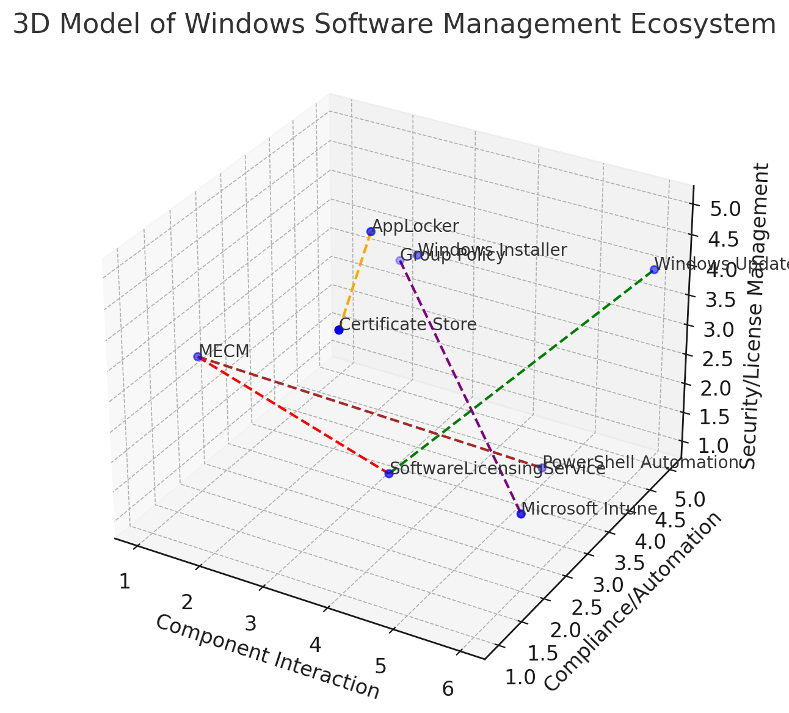

### Zarządzanie Oprogramowaniem w Ekosystemie Windows: MECM i SoftwareLicensingService

Zarządzanie oprogramowaniem w środowisku Windows wymaga efektywnych narzędzi do aktualizacji, aktualizacji systemów, współpracy z różnymi usługami oraz automatyzacji procesów licencyjnych. Kluczowymi elementami tego ekosystemu są Microsoft Endpoint Configuration Manager (MECM) oraz SoftwareLicensingService, które w połączeniu z Windows Management Instrumentation (WMI) umożliwiają kompleksowe zarządzanie licencjami oraz kontrolę nad oprogramowaniem w organizacji.

# 3D Model of Windows Software Management Ecosystem

## Legend:

1. **MECM**: Manages the deployment and updates of software.
2. **SoftwareLicensingService**: Handles license activation and compliance.
3. **AppLocker**: Ensures application security by controlling executable access.
4. **Windows Update**: Automates OS updates and patch management.
5. **Group Policy**: Manages system-wide settings and security policies.
6. **PowerShell Automation**: Executes scripts for software management.
7. **Windows Installer**: Handles software installation and version management.
8. **Certificate Store**: Verifies the authenticity of executables.
9. **Microsoft Intune**: Handles remote device and software management, particularly in cloud environments.

#### 1. **Microsoft Endpoint Configuration Manager (MECM)**

MECM, wcześniej znany jako System Center Configuration Manager (SCCM), jest potężnym narzędziem do zarządzania infrastrukturą IT w organizacjach. Oferuje szeroki zakres funkcji, które obejmują:

- **Deployment Oprogramowania:** MECM umożliwia automatyczne instalowanie aplikacji na komputerach klienckich. Dzięki temu administratorzy mogą centralnie zarządzać dystrybucją oprogramowania, minimalizując konieczność ręcznego instalowania aplikacji na poszczególnych urządzeniach. MECM wspiera różnorodne metody instalacji, w tym instalacje bezinteraktywne, co zwiększa efektywność wdrażania.

- **Zarządzanie Aktualizacjami:** Centralne zarządzanie i dystrybucja aktualizacji systemu operacyjnego oraz aplikacji są kluczowe dla utrzymania bezpieczeństwa i wydajności systemów. MECM umożliwia planowanie wdrożeń aktualizacji, monitorowanie ich statusu oraz raportowanie ewentualnych problemów, co zapewnia spójność środowiska IT.

- **Monitorowanie Stanu Systemów:** MECM śledzi stan zdrowia i wydajności urządzeń w sieci. Monitorowanie obejmuje zarówno sprzęt, jak i oprogramowanie, co pozwala na wczesne wykrywanie problemów oraz proaktywne zarządzanie zasobami IT.

- **Zarządzanie Konfiguracją:** Administratorzy mogą ustawiać i egzekwować polityki konfiguracyjne na urządzeniach klienckich. MECM umożliwia definiowanie standardów konfiguracji, co zapewnia zgodność z wewnętrznymi politykami oraz wymaganiami regulacyjnymi.

#### 2. **SoftwareLicensingService w Windows**

SoftwareLicensingService to klasa WMI w systemie Windows, która umożliwia zarządzanie licencjami systemu operacyjnego i zainstalowanego oprogramowania. Główne funkcje tej usługi obejmują:

- **Instalacja Kluczy Licencyjnych:** Metoda `InstallProductKey` pozwala administratorom na instalowanie kluczy produktu dla systemów operacyjnych i aplikacji. Automatyzacja tego procesu jest kluczowa dla dużych organizacji, gdzie ręczne wprowadzanie kluczy na każdym urządzeniu jest niepraktyczne.

- **Sprawdzanie Statusu Licencji:** Metody takie jak `GetActivationStatus` umożliwiają monitorowanie stanu aktywacji oprogramowania. Dzięki temu administratorzy mogą szybko identyfikować urządzenia z nieaktywnymi lub niewłaściwie licencjonowanymi produktami.

- **Zdalne Zarządzanie Licencjami:** Od Windows Vista, SoftwareLicensingService pozwala na zdalną kontrolę i zarządzanie licencjami, co jest kluczowe dla dużych organizacji. Zdalne zarządzanie umożliwia centralne administrowanie licencjami bez konieczności fizycznego dostępu do każdego urządzenia.

#### 3. **Integracja MECM z SoftwareLicensingService przez WMI**

Integracja MECM z SoftwareLicensingService odbywa się poprzez WMI, co umożliwia:

- **Automatyzację Instalacji Kluczy:** Administratorzy mogą tworzyć skrypty w MECM, które automatycznie instalują klucze licencyjne na urządzeniach klienckich. Dzięki temu proces instalacji jest szybszy, bardziej niezawodny i mniej podatny na błędy ludzkie.

- **Monitorowanie Zgodności Licencyjnej:** Dzięki WMI, MECM może regularnie sprawdzać status licencji i raportować niezgodności. System może automatycznie wykrywać urządzenia z niewłaściwymi licencjami i generować odpowiednie alerty, co ułatwia utrzymanie zgodności z politykami licencyjnymi.

- **Centralne Zarządzanie:** Umożliwia scentralizowane zarządzanie licencjami bez konieczności manualnej interwencji na każdym urządzeniu. Centralizacja procesu zarządzania licencjami zwiększa efektywność operacyjną i ułatwia audyty licencyjne.

#### 4. **Aktualizacje i Upgrade'y w Ekosystemie Windows**

Efektywne zarządzanie aktualizacjami i upgrade'ami jest kluczowe dla bezpieczeństwa i wydajności systemów:

- **Automatyczne Dystrybucje:** MECM pozwala na planowanie i automatyczne wdrażanie aktualizacji systemowych oraz aplikacyjnych. Administratorzy mogą definiować harmonogramy aktualizacji, minimalizując zakłócenia w pracy użytkowników końcowych.

- **Testowanie Aktualizacji:** MECM umożliwia testowanie aktualizacji na grupach pilotowych przed pełnym wdrożeniem. Dzięki temu można zidentyfikować potencjalne problemy i uniknąć ich szerokiego rozprzestrzenienia w organizacji.

- **Zarządzanie Wersjami:** Centralne zarządzanie różnymi wersjami oprogramowania ułatwia proces upgrade'ów. MECM pozwala na utrzymanie spójności wersji oprogramowania w całej organizacji, co jest istotne dla kompatybilności i stabilności systemów.

#### 5. **Współpraca z Usługami Takimi Jak Asset Intelligence i Software Metering**

MECM integruje się z innymi usługami, które wzbogacają zarządzanie oprogramowaniem:

- **Asset Intelligence:** Zbiera i analizuje dane o zainstalowanym oprogramowaniu, co pozwala na lepsze zarządzanie zasobami i licencjami. Dzięki temu można dokładnie śledzić, które aplikacje są używane, a które są zbędne, co pomaga w optymalizacji kosztów licencyjnych.

- **Software Metering:** Monitoruje wykorzystanie oprogramowania, co pomaga w optymalizacji licencji i kosztów. Dane z Software Metering umożliwiają analizę rzeczywistego użycia aplikacji, co pozwala na lepsze dopasowanie zakupów licencyjnych do potrzeb organizacji.

- **BitLocker Integration:** Współpraca z narzędziami bezpieczeństwa, takimi jak BitLocker, zapewnia zgodność z politykami bezpieczeństwa firmy. MECM może zarządzać kluczami BitLocker, monitorować stan szyfrowania oraz automatycznie wdrażać polityki bezpieczeństwa na urządzeniach klienckich.

#### 6. **Praktyczna Automatyzacja Zarządzania Licencjami**

Automatyzacja procesów zarządzania licencjami zwiększa efektywność i redukuje ryzyko błędów:

- **Skrypty PowerShell:** Użycie skryptów PowerShell w MECM do automatycznego instalowania i aktualizacji kluczy licencyjnych. PowerShell umożliwia tworzenie zaawansowanych skryptów, które mogą integrować się z innymi systemami oraz automatyzować skomplikowane procesy zarządzania licencjami.

- **Zadania Planowane:** Tworzenie zadań w MECM, które regularnie sprawdzają status licencji i generują raporty. Zadania planowane mogą działać w określonych interwałach czasowych, co zapewnia ciągłe monitorowanie zgodności licencyjnej.

- **Integracja z Systemami ITSM:** Połączenie MECM z systemami zarządzania usługami IT (ITSM) umożliwia automatyczne zgłaszanie i śledzenie problemów związanych z licencjami. Integracja ta pozwala na lepszą koordynację działań IT oraz szybsze rozwiązywanie problemów licencyjnych.

#### 7. **Bezpieczeństwo i Zgodność Licencyjna**

Zarządzanie licencjami nie tylko zapewnia zgodność z prawem, ale także wpływa na bezpieczeństwo systemów:

- **Monitorowanie Nieautoryzowanych Instalacji:** Dzięki integracji z SoftwareLicensingService, MECM może wykrywać i raportować nieautoryzowane instalacje oprogramowania. Szybkie wykrywanie nielegalnych instalacji pozwala na szybkie reagowanie i eliminowanie potencjalnych zagrożeń bezpieczeństwa.

- **Egzekwowanie Polityk Licencyjnych:** Automatyczne wdrażanie polityk licencyjnych, które zapewniają, że wszystkie oprogramowanie jest legalnie licencjonowane. Polityki te mogą definiować zasady instalacji, użytkowania oraz aktualizacji oprogramowania, co pomaga w utrzymaniu zgodności z przepisami.

- **Ochrona Przed Atakami:** Aktualizacje i patche zarządzane przez MECM pomagają w zabezpieczeniu systemów przed zagrożeniami. Regularne aktualizacje zmniejszają ryzyko wykorzystania luk bezpieczeństwa przez złośliwe oprogramowanie oraz inne zagrożenia cybernetyczne.

#### 8. **Raportowanie i Audyty Licencyjne**

Regularne raportowanie i audyty są niezbędne dla utrzymania zgodności licencyjnej:

- **Raporty Zgodności:** MECM generuje raporty dotyczące zgodności licencyjnej, które mogą być wykorzystane podczas audytów. Raporty te zawierają szczegółowe informacje na temat stanu licencji, co ułatwia przygotowanie się do audytów oraz identyfikację ewentualnych niezgodności.

- **Analiza Wykorzystania:** Software Metering dostarcza danych na temat faktycznego wykorzystania oprogramowania, co pomaga w optymalizacji licencji. Analiza ta umożliwia identyfikację niewykorzystywanych aplikacji oraz lepsze dopasowanie zakupów licencyjnych do rzeczywistych potrzeb organizacji.

- **Historia Licencji:** Przechowywanie historii licencyjnej umożliwia śledzenie zmian i ułatwia procesy audytowe. Historia ta może zawierać informacje o zakupionych licencjach, przypisanych kluczach oraz historii instalacji i aktywacji oprogramowania.

#### 9. **Ewolucja Zarządzania Licencjami od Windows Vista**

Od momentu wprowadzenia SoftwareLicensingService w Windows Vista, zarządzanie licencjami ewoluowało, dostosowując się do rosnących potrzeb organizacji:

- **Zwiększona Automatyzacja:** Nowe wersje systemu Windows oferują bardziej zaawansowane narzędzia do automatyzacji zarządzania licencjami. Automatyzacja obejmuje nie tylko instalację i aktywację kluczy, ale także monitorowanie zgodności oraz zarządzanie cyklem życia licencji.

- **Lepsza Integracja z Chmurą:** Integracja z usługami chmurowymi umożliwia elastyczne zarządzanie licencjami w środowiskach hybrydowych. Usługi takie jak Microsoft 365 pozwalają na centralne zarządzanie licencjami zarówno dla środowisk lokalnych, jak i chmurowych, co zwiększa elastyczność i skalowalność zarządzania oprogramowaniem.

- **Rozszerzone API:** Ulepszone API pozwala na bardziej zaawansowane integracje z innymi systemami zarządzania IT. Dzięki temu organizacje mogą tworzyć bardziej spersonalizowane rozwiązania do zarządzania licencjami, integrując je z istniejącymi narzędziami oraz procesami biznesowymi.

#### 10. **Warstwa Siódma Modelu OSI: Zarządzanie Aplikacjami**

Warstwa siódma modelu OSI, czyli warstwa aplikacji, odgrywa kluczową rolę w zarządzaniu aplikacjami w ekosystemie Windows. Zarządzanie aplikacjami na tej warstwie obejmuje:

- **Interfejsy Użytkownika:** Aplikacje w warstwie aplikacji komunikują się bezpośrednio z użytkownikami końcowymi. Zarządzanie tymi interfejsami wymaga zapewnienia, że aplikacje są intuicyjne, responsywne i zgodne z wymaganiami użytkowników.

- **Protokół Komunikacyjny:** Aplikacje wykorzystują różnorodne protokoły komunikacyjne do wymiany danych z innymi aplikacjami oraz usługami. MECM zarządza konfiguracją tych protokołów, zapewniając bezpieczeństwo oraz efektywność komunikacji.

- **Integracja z Usługami Sieciowymi:** Aplikacje w warstwie aplikacji często integrują się z usługami sieciowymi, takimi jak serwery baz danych, usługi webowe czy API. MECM umożliwia zarządzanie tymi integracjami, zapewniając spójność i dostępność usług.

- **Bezpieczeństwo Aplikacji:** Zarządzanie aplikacjami obejmuje również zapewnienie ich bezpieczeństwa. MECM wspiera wdrażanie aktualizacji bezpieczeństwa oraz konfigurację aplikacji w sposób zgodny z politykami bezpieczeństwa organizacji.

#### 11. **Współpraca z Usługami Zarządzającymi Licencjami**

Oprócz MECM i SoftwareLicensingService, istnieją inne usługi wspierające zarządzanie oprogramowaniem i jego licencjami w ekosystemie Windows:

- **Azure Active Directory (Azure AD):** Umożliwia zarządzanie tożsamością oraz dostępem do aplikacji i usług w chmurze. Integracja MECM z Azure AD pozwala na centralne zarządzanie licencjami opartymi na subskrypcjach oraz zapewnia bezpieczeństwo dostępu.

- **Microsoft Intune:** Usługa chmurowa do zarządzania urządzeniami mobilnymi oraz aplikacjami. Intune współpracuje z MECM, umożliwiając zarządzanie oprogramowaniem zarówno w środowiskach lokalnych, jak i chmurowych.

- **Azure Information Protection (AIP):** Usługa zabezpieczania danych poprzez klasyfikację, etykietowanie oraz szyfrowanie. Integracja AIP z MECM pozwala na zabezpieczanie aplikacji oraz danych, co zwiększa poziom bezpieczeństwa całego ekosystemu IT.

- **Microsoft Defender for Endpoint:** Narzędzie do ochrony końcowych punktów przed zagrożeniami. Integracja z MECM umożliwia zarządzanie politykami bezpieczeństwa oraz monitorowanie stanu zabezpieczeń urządzeń.

#### 12. **Przyszłość Zarządzania Oprogramowaniem w Windows**

Zarządzanie oprogramowaniem w ekosystemie Windows będzie nadal ewoluować, odpowiadając na zmieniające się potrzeby organizacji oraz rozwój technologii:

- **Sztuczna Inteligencja i Uczenie Maszynowe:** Integracja AI i ML z narzędziami zarządzania oprogramowaniem umożliwi predykcyjne analizy oraz automatyzację bardziej złożonych procesów zarządzania licencjami i aktualizacjami.

- **Zarządzanie Oprogramowaniem jako Usługą (SaaS):** Wzrost popularności aplikacji SaaS wymaga bardziej elastycznych modeli zarządzania licencjami oraz integracji z usługami chmurowymi.

- **Zwiększona Automatyzacja:** Automatyzacja będzie kluczowym elementem przyszłości zarządzania oprogramowaniem, umożliwiając jeszcze większą efektywność oraz redukcję kosztów operacyjnych.

- **Bezpieczeństwo i Zgodność:** W obliczu rosnących zagrożeń cybernetycznych, zarządzanie oprogramowaniem będzie coraz bardziej skoncentrowane na bezpieczeństwie oraz zgodności z regulacjami prawnymi.

#### 13. **Podsumowanie**

Zarządzanie oprogramowaniem w ekosystemie Windows, z wykorzystaniem MECM i SoftwareLicensingService, oferuje kompleksowe rozwiązania dla organizacji dążących do efektywnego zarządzania licencjami, aktualizacjami i bezpieczeństwem systemów. Integracja z WMI oraz narzędziami takimi jak Asset Intelligence i Software Metering umożliwia automatyzację procesów, zwiększając zgodność licencyjną i optymalizując koszty. Dzięki ciągłemu rozwojowi narzędzi zarządzania, organizacje mogą lepiej dostosować się do dynamicznych wymagań środowiska IT, zapewniając jednocześnie bezpieczeństwo i zgodność z politykami firmy.

Ewolucja zarządzania licencjami od Windows Vista do najnowszych wersji systemu Windows pokazuje, jak technologie zarządzania oprogramowaniem stają się coraz bardziej zaawansowane i zintegrowane z innymi usługami IT. Przyszłość zarządzania oprogramowaniem w ekosystemie Windows zapowiada się jeszcze bardziej zautomatyzowana, bezpieczna i elastyczna, co pozwoli organizacjom na skuteczne reagowanie na zmieniające się potrzeby biznesowe oraz technologiczne.

W kontekście modelu OSI, zarządzanie aplikacjami na warstwie siódmej wymaga nie tylko technicznej infrastruktury, ale również strategicznego podejścia do zarządzania zasobami, licencjami oraz bezpieczeństwem. Dzięki narzędziom takim jak MECM i SoftwareLicensingService, organizacje mogą skutecznie zarządzać swoimi zasobami IT, minimalizując ryzyko związane z niezgodnością licencyjną oraz zapewniając wysoką jakość usług dla użytkowników końcowych.

---

### Dodatkowe Rozważania

Aby jeszcze lepiej zrozumieć zarządzanie oprogramowaniem w ekosystemie Windows, warto rozważyć kilka dodatkowych aspektów:

- **Zarządzanie Cyfrowym Śladem:** Organizacje muszą zarządzać swoim cyfrowym śladem, czyli informacjami o wszystkich zainstalowanych aplikacjach i systemach. MECM i SoftwareLicensingService umożliwiają dokładne śledzenie tych informacji, co jest kluczowe dla zarządzania zasobami oraz zgodności z przepisami.

- **Zarządzanie Zgodnością z Regulacjami:** Wiele branż jest regulowanych prawnie pod względem zarządzania danymi i oprogramowaniem. Narzędzia zarządzania oprogramowaniem muszą wspierać organizacje w utrzymaniu zgodności z regulacjami, takimi jak GDPR, HIPAA czy inne specyficzne dla danej branży.

- **Zarządzanie Zdalnymi Urządzeniami:** W dobie pracy zdalnej, zarządzanie oprogramowaniem na zdalnych urządzeniach staje się coraz ważniejsze. MECM wspiera zarządzanie urządzeniami niezależnie od ich lokalizacji, co jest kluczowe dla utrzymania spójności i bezpieczeństwa w dynamicznie zmieniającym się środowisku pracy.

- **Użytkownik Końcowy jako Klient:** Zarządzanie oprogramowaniem musi uwzględniać doświadczenie użytkownika końcowego. Intuicyjne interfejsy, minimalne zakłócenia podczas aktualizacji oraz szybki dostęp do wsparcia technicznego są kluczowe dla utrzymania wysokiego poziomu satysfakcji użytkowników.

- **Zarządzanie Zasobami Chmurowymi:** Coraz więcej organizacji korzysta z zasobów chmurowych. Integracja zarządzania oprogramowaniem z zasobami chmurowymi, takimi jak Azure, umożliwia bardziej elastyczne i skalowalne podejście do zarządzania licencjami oraz aplikacjami.

### Przykłady Implementacji

Aby lepiej zrozumieć praktyczne zastosowanie narzędzi zarządzania oprogramowaniem w ekosystemie Windows, warto przeanalizować kilka przykładów implementacji:

- **Automatyczne Wdrażanie Aktualizacji:** Firma X wykorzystuje MECM do automatycznego wdrażania aktualizacji systemu operacyjnego oraz aplikacji na wszystkich urządzeniach w sieci. Dzięki temu minimalizuje czas przestojów oraz zapewnia, że wszystkie systemy są aktualne i zabezpieczone przed najnowszymi zagrożeniami.

- **Centralne Zarządzanie Licencjami:** Organizacja Y korzysta z integracji MECM z SoftwareLicensingService do centralnego zarządzania licencjami oprogramowania. Automatyczne instalowanie kluczy licencyjnych oraz regularne monitorowanie zgodności licencyjnej pozwala na optymalizację kosztów oraz uniknięcie problemów związanych z audytami licencyjnymi.

- **Optymalizacja Wykorzystania Oprogramowania:** Firma Z używa Software Metering w MECM do monitorowania wykorzystania oprogramowania. Analiza danych pozwala na identyfikację niewykorzystywanych aplikacji, co umożliwia redukcję liczby zakupionych licencji oraz oszczędności kosztów.

### Wnioski

Zarządzanie oprogramowaniem w ekosystemie Windows jest złożonym procesem, który wymaga zastosowania zaawansowanych narzędzi oraz strategii. Microsoft Endpoint Configuration Manager (MECM) oraz SoftwareLicensingService, w połączeniu z Windows Management Instrumentation (WMI), oferują kompleksowe rozwiązania umożliwiające efektywne zarządzanie licencjami, aktualizacjami oraz bezpieczeństwem systemów. Integracja z innymi usługami, takimi jak Asset Intelligence, Software Metering, Azure AD czy Microsoft Intune, dodatkowo wzbogaca możliwości zarządzania, zapewniając elastyczność i skalowalność w dynamicznym środowisku IT.

Automatyzacja procesów zarządzania licencjami oraz aktualizacjami jest kluczowa dla zwiększenia efektywności operacyjnej i redukcji ryzyka błędów. Dzięki narzędziom takim jak MECM, organizacje mogą centralnie zarządzać swoim oprogramowaniem, zapewniając zgodność z politykami licencyjnymi oraz bezpieczeństwo systemów.

Przyszłość zarządzania oprogramowaniem w ekosystemie Windows zapowiada się obiecująco, z rosnącym naciskiem na automatyzację, integrację z chmurą oraz wykorzystanie zaawansowanych technologii, takich jak sztuczna inteligencja. Organizacje, które skutecznie wdrożą nowoczesne narzędzia zarządzania oprogramowaniem, będą lepiej przygotowane na wyzwania związane z dynamicznie zmieniającym się środowiskiem IT, zapewniając jednocześnie wysoką jakość usług oraz zgodność z regulacjami prawnymi.

---

### Rola Integracji Usług Systemowych Windows w MECM i SLS

W kontekście zarządzania oprogramowaniem, licencjonowania i współpracy systemu operacyjnego Windows z kodem wykonywalnym, istotnymi składowymi ekosystemu są różnorodne usługi, narzędzia oraz interfejsy, które wspierają automatyzację, monitorowanie, instalację i zarządzanie oprogramowaniem. Oto kluczowe składowe ekosystemu Windows w tym zakresie:

### 1. **Microsoft Endpoint Configuration Manager (MECM/SCCM)**
   - **Opis**: Narzędzie do zarządzania infrastrukturą IT, które umożliwia instalację oprogramowania, zarządzanie aktualizacjami, monitorowanie stanu systemów oraz zarządzanie politykami konfiguracyjnymi na komputerach w sieci.
   - **Funkcje**:
     - Dystrybucja oprogramowania
     - Zarządzanie aktualizacjami
     - Monitorowanie stanu systemów
     - Zarządzanie konfiguracją
     - Integracja z usługami zarządzającymi licencjami i oprogramowaniem

### 2. **SoftwareLicensingService (SLS)**
   - **Opis**: Usługa WMI odpowiedzialna za zarządzanie licencjami systemu operacyjnego oraz oprogramowania. Zapewnia funkcje związane z instalacją kluczy produktu, monitorowaniem aktywacji i zdalnym zarządzaniem licencjami.
   - **Funkcje**:
     - Instalacja kluczy licencyjnych (`InstallProductKey`)
     - Sprawdzanie statusu licencji (`GetActivationStatus`)
     - Zdalne zarządzanie licencjami

### 3. **Windows Management Instrumentation (WMI)**
   - **Opis**: Natywny interfejs Windows umożliwiający zarządzanie i monitorowanie zasobów systemu. WMI jest wykorzystywane przez narzędzia takie jak MECM do zarządzania licencjami, konfiguracją i stanem systemów.
   - **Funkcje**:
     - Udostępnianie danych o stanie systemu
     - Automatyzacja zadań administracyjnych
     - Interakcja z innymi narzędziami systemowymi (np. PowerShell)

### 4. **Windows Update (WU)**
   - **Opis**: Usługa systemowa odpowiedzialna za instalację i zarządzanie aktualizacjami systemu operacyjnego oraz oprogramowania w Windows.
   - **Funkcje**:
     - Automatyczna instalacja aktualizacji systemowych
     - Zarządzanie cyklami życia aktualizacji
     - Integracja z narzędziami do zarządzania aktualizacjami, takimi jak MECM

### 5. **Windows Installer (MSI)**
   - **Opis**: Usługa instalacyjna w Windows, która zapewnia narzędzia i procesy instalacji, naprawy i usuwania aplikacji z systemu.
   - **Funkcje**:
     - Instalacja i aktualizacja aplikacji korzystających z pakietów MSI
     - Rejestrowanie zainstalowanego oprogramowania w systemie
     - Automatyzacja instalacji aplikacji w środowiskach organizacji

### 6. **Group Policy (GP)**
   - **Opis**: Mechanizm centralnego zarządzania konfiguracją systemów Windows w środowiskach domenowych. Umożliwia definiowanie polityk instalacji oprogramowania, konfiguracji systemu oraz zabezpieczeń.
   - **Funkcje**:
     - Zarządzanie instalacją oprogramowania w sieci
     - Automatyzacja konfiguracji i ustawień systemowych
     - Zastosowanie polityk zabezpieczeń i konfiguracji dla użytkowników i komputerów

### 7. **Windows Deployment Services (WDS)**
   - **Opis**: Narzędzie umożliwiające zdalną instalację systemów operacyjnych i oprogramowania na urządzeniach w sieci za pomocą obrazów systemowych.
   - **Funkcje**:
     - Tworzenie i dystrybucja obrazów systemowych
     - Zdalne wdrażanie systemów operacyjnych
     - Integracja z narzędziami takimi jak MECM

### 8. **PowerShell**
   - **Opis**: Natywny język skryptowy i narzędzie administracyjne w Windows, wykorzystywane do automatyzacji zadań, zarządzania systemem i interakcji z WMI.
   - **Funkcje**:
     - Automatyzacja zadań administracyjnych
     - Tworzenie skryptów do zarządzania oprogramowaniem i licencjami
     - Integracja z narzędziami zarządzającymi, np. MECM i SoftwareLicensingService

### 9. **Windows Autopilot**
   - **Opis**: Usługa, która upraszcza wdrażanie nowych urządzeń, umożliwiając ich automatyczne konfiguracje i instalację oprogramowania.
   - **Funkcje**:
     - Automatyczna konfiguracja urządzeń w organizacjach
     - Integracja z usługami chmurowymi (Microsoft 365, Intune)
     - Zdalne zarządzanie oprogramowaniem i licencjami

### 10. **Azure Active Directory (Azure AD)**
   - **Opis**: Chmurowa usługa tożsamości, umożliwiająca zarządzanie użytkownikami i ich dostępem do aplikacji oraz zasobów, zarówno lokalnych, jak i chmurowych.
   - **Funkcje**:
     - Zarządzanie dostępem do aplikacji i licencjami w chmurze
     - Integracja z narzędziami zarządzania licencjami, np. Microsoft Intune
     - Uwierzytelnianie i autoryzacja w środowiskach hybrydowych

### 11. **Microsoft Intune**
   - **Opis**: Usługa chmurowa do zarządzania urządzeniami mobilnymi (MDM) i aplikacjami, w tym zarządzania oprogramowaniem i licencjami.
   - **Funkcje**:
     - Zarządzanie licencjami oprogramowania w środowisku chmurowym i hybrydowym
     - Monitorowanie i aktualizowanie aplikacji na urządzeniach mobilnych
     - Integracja z MECM w ramach zarządzania oprogramowaniem

### 12. **Windows Defender Application Control (WDAC)**
   - **Opis**: Mechanizm umożliwiający kontrolowanie, które aplikacje mogą być uruchamiane w systemie Windows, co zwiększa bezpieczeństwo i zgodność z politykami firmowymi.
   - **Funkcje**:
     - Definiowanie zasad uruchamiania aplikacji
     - Ochrona przed nieautoryzowanymi aplikacjami i zagrożeniami
     - Integracja z politykami zarządzania oprogramowaniem

### 13. **Asset Intelligence**
   - **Opis**: Usługa dostępna w MECM, która umożliwia monitorowanie i zarządzanie zasobami IT, w tym oprogramowaniem, co wspiera optymalizację licencji.
   - **Funkcje**:
     - Śledzenie zasobów oprogramowania
     - Optymalizacja kosztów licencyjnych poprzez monitorowanie użycia aplikacji

### 14. **Software Metering**
   - **Opis**: Funkcja wbudowana w MECM, która umożliwia monitorowanie użycia oprogramowania w organizacji.
   - **Funkcje**:
     - Monitorowanie rzeczywistego użycia aplikacji
     - Pomoc w optymalizacji licencji na podstawie rzeczywistego wykorzystania

### 15. **Microsoft 365 (dawniej Office 365)**
   - **Opis**: Platforma chmurowa oferująca usługi produktywności, zintegrowana z narzędziami zarządzania licencjami i użytkownikami w środowisku Windows.
   - **Funkcje**:
     - Zarządzanie subskrypcjami i licencjami aplikacji
     - Centralne zarządzanie oprogramowaniem w chmurze

### 16. **Microsoft Store for Business**
   - **Opis**: Platforma umożliwiająca organizacjom zarządzanie zakupami, dystrybucją i licencjonowaniem aplikacji z Microsoft Store.
   - **Funkcje**:
     - Centralne zakupy i dystrybucja aplikacji
     - Zarządzanie licencjami aplikacji zakupionych przez firmę

---

### Podsumowanie

Każda z wymienionych składowych ekosystemu Windows odgrywa istotną rolę w zarządzaniu oprogramowaniem, licencjami i procesami wdrażania aplikacji w środowisku IT. Integracja między tymi usługami, takimi jak MECM, WMI, PowerShell, i SoftwareLicensingService, zapewnia szerokie możliwości automatyzacji oraz centralizacji zarządzania. W tym ekosystemie usługi chmurowe (Azure AD, Intune) i lokalne (MECM, WMI) współpracują, aby efektywnie zarządzać cyklem życia oprogramowania w dużych organizacjach.

---

### Rola Integracji Usług Systemowych Windows w MECM i SLS

Integracja usług systemowych Windows, takich jak MECM (Microsoft Endpoint Configuration Manager) i SLS (SoftwareLicensingService), odgrywa kluczową rolę w efektywnym zarządzaniu oprogramowaniem, licencjonowaniem oraz bezpieczeństwem w organizacjach. Poniżej przedstawiono główne aspekty tej integracji:

#### **Automatyzacja Procesów Zarządzania**

- **Instalacja i Aktywacja Licencji:** Dzięki integracji MECM z SLS przez WMI, proces instalacji i aktywacji kluczy licencyjnych może być całkowicie zautomatyzowany. Administratorzy mogą definiować skrypty PowerShell w MECM, które automatycznie wprowadzają klucze licencyjne na nowych lub istniejących urządzeniach, eliminując potrzebę ręcznej interwencji.

- **Automatyczne Wdrażanie Aktualizacji:** MECM zarządza aktualizacjami systemu operacyjnego i oprogramowania, wykorzystując funkcje SLS do monitorowania zgodności licencyjnej po każdej aktualizacji. Dzięki temu aktualizacje są nie tylko wdrażane automatycznie, ale również sprawdzane pod kątem zgodności z licencjami.

#### **Monitorowanie i Raportowanie**

- **Zgodność Licencyjna:** Integracja MECM z SLS umożliwia ciągłe monitorowanie stanu licencji w organizacji. MECM korzysta z danych dostarczanych przez SLS poprzez WMI, aby generować raporty zgodności licencyjnej, identyfikować urządzenia z niewłaściwymi licencjami i automatycznie tworzyć alerty dla administratorów.

- **Monitorowanie Stanu Systemów:** WMI dostarcza MECM informacji na temat stanu zdrowia systemów i aplikacji. Dzięki temu MECM może proaktywnie identyfikować i rozwiązywać problemy przed ich eskalacją, zapewniając ciągłość działania i minimalizując przestoje.

#### **Centralne Zarządzanie**

- **Zarządzanie Zasobami IT:** MECM integruje się z usługami takimi jak Asset Intelligence i Software Metering, umożliwiając centralne zarządzanie zasobami IT. Scentralizowane zarządzanie zasobami pozwala na lepszą kontrolę nad licencjami, optymalizację kosztów oraz efektywne wykorzystanie dostępnych zasobów.

- **Polityki Konfiguracyjne:** Dzięki integracji z Group Policy oraz innymi narzędziami konfiguracyjnymi, MECM umożliwia centralne definiowanie i egzekwowanie polityk konfiguracyjnych na wszystkich urządzeniach w sieci. To zapewnia zgodność z wewnętrznymi standardami oraz wymogami regulacyjnymi.

#### **Bezpieczeństwo i Zgodność**

- **Kontrola Aplikacji:** Integracja MECM z Windows Defender Application Control (WDAC) pozwala na kontrolowanie, które aplikacje mogą być uruchamiane na urządzeniach w organizacji. To zwiększa bezpieczeństwo systemów, chroniąc je przed nieautoryzowanymi i potencjalnie złośliwymi aplikacjami.

- **Zarządzanie Zgodnością z Regulacjami:** MECM, w połączeniu z SLS i innymi usługami, umożliwia organizacjom utrzymanie zgodności z regulacjami prawnymi dotyczącymi zarządzania oprogramowaniem i danymi, takimi jak GDPR czy HIPAA. Dzięki automatyzacji procesów zarządzania licencjami i aktualizacjami, organizacje mogą łatwiej spełniać wymogi prawne i audytowe.

#### **Współpraca z Usługami Chmurowymi**

- **Integracja z Azure AD i Intune:** MECM współpracuje z usługami chmurowymi takimi jak Azure Active Directory i Microsoft Intune, co umożliwia zarządzanie oprogramowaniem i licencjami zarówno w środowiskach lokalnych, jak i chmurowych. Ta integracja zapewnia elastyczność i skalowalność zarządzania oprogramowaniem w dynamicznie zmieniających się środowiskach IT.

#### **Skalowalność i Elastyczność**

- **Zarządzanie Dużymi Środowiskami:** Integracja MECM z SLS poprzez WMI umożliwia efektywne zarządzanie licencjami i oprogramowaniem w dużych środowiskach IT. Centralne zarządzanie i automatyzacja procesów pozwala na skalowanie działań zarządzających oprogramowaniem bez zwiększania nakładu pracy administracyjnej.

- **Elastyczność w Zarządzaniu Oprogramowaniem:** MECM pozwala na zarządzanie różnymi typami oprogramowania i licencji, w tym aplikacji SaaS, tradycyjnych aplikacji desktopowych oraz aplikacji mobilnych. Integracja z SLS i innymi usługami systemowymi zapewnia elastyczność w zarządzaniu różnorodnym oprogramowaniem w organizacji.

---

### Kluczowe Składowe Ekosystemu Windows w Zarządzaniu Oprogramowaniem

W kontekście zarządzania oprogramowaniem, licencjonowania i współpracy systemu operacyjnego Windows z kodem wykonywalnym, istotnymi składowymi ekosystemu są różnorodne usługi, narzędzia oraz interfejsy, które wspierają automatyzację, monitorowanie, instalację i zarządzanie oprogramowaniem. Oto kluczowe składowe ekosystemu Windows w tym zakresie:

### 1. **Microsoft Endpoint Configuration Manager (MECM/SCCM)**
   - **Opis**: Narzędzie do zarządzania infrastrukturą IT, które umożliwia instalację oprogramowania, zarządzanie aktualizacjami, monitorowanie stanu systemów oraz zarządzanie politykami konfiguracyjnymi na komputerach w sieci.
   - **Funkcje**:
     - Dystrybucja oprogramowania
     - Zarządzanie aktualizacjami
     - Monitorowanie stanu systemów
     - Zarządzanie konfiguracją
     - Integracja z usługami zarządzającymi licencjami i oprogramowaniem

### 2. **SoftwareLicensingService (SLS)**
   - **Opis**: Usługa WMI odpowiedzialna za zarządzanie licencjami systemu operacyjnego oraz oprogramowania. Zapewnia funkcje związane z instalacją kluczy produktu, monitorowaniem aktywacji i zdalnym zarządzaniem licencjami.
   - **Funkcje**:
     - Instalacja kluczy licencyjnych (`InstallProductKey`)
     - Sprawdzanie statusu licencji (`GetActivationStatus`)
     - Zdalne zarządzanie licencjami

### 3. **Windows Management Instrumentation (WMI)**
   - **Opis**: Natywny interfejs Windows umożliwiający zarządzanie i monitorowanie zasobów systemu. WMI jest wykorzystywane przez narzędzia takie jak MECM do zarządzania licencjami, konfiguracją i stanem systemów.
   - **Funkcje**:
     - Udostępnianie danych o stanie systemu
     - Automatyzacja zadań administracyjnych
     - Interakcja z innymi narzędziami systemowymi (np. PowerShell)

### 4. **Windows Update (WU)**
   - **Opis**: Usługa systemowa odpowiedzialna za instalację i zarządzanie aktualizacjami systemu operacyjnego oraz oprogramowania w Windows.
   - **Funkcje**:
     - Automatyczna instalacja aktualizacji systemowych
     - Zarządzanie cyklami życia aktualizacji
     - Integracja z narzędziami do zarządzania aktualizacjami, takimi jak MECM

### 5. **Windows Installer (MSI)**
   - **Opis**: Usługa instalacyjna w Windows, która zapewnia narzędzia i procesy instalacji, naprawy i usuwania aplikacji z systemu.
   - **Funkcje**:
     - Instalacja i aktualizacja aplikacji korzystających z pakietów MSI
     - Rejestrowanie zainstalowanego oprogramowania w systemie
     - Automatyzacja instalacji aplikacji w środowiskach organizacji

### 6. **Group Policy (GP)**
   - **Opis**: Mechanizm centralnego zarządzania konfiguracją systemów Windows w środowiskach domenowych. Umożliwia definiowanie polityk instalacji oprogramowania, konfiguracji systemu oraz zabezpieczeń.
   - **Funkcje**:
     - Zarządzanie instalacją oprogramowania w sieci
     - Automatyzacja konfiguracji i ustawień systemowych
     - Zastosowanie polityk zabezpieczeń i konfiguracji dla użytkowników i komputerów

### 7. **Windows Deployment Services (WDS)**
   - **Opis**: Narzędzie umożliwiające zdalną instalację systemów operacyjnych i oprogramowania na urządzeniach w sieci za pomocą obrazów systemowych.
   - **Funkcje**:
     - Tworzenie i dystrybucja obrazów systemowych
     - Zdalne wdrażanie systemów operacyjnych
     - Integracja z narzędziami takimi jak MECM

### 8. **PowerShell**
   - **Opis**: Natywny język skryptowy i narzędzie administracyjne w Windows, wykorzystywane do automatyzacji zadań, zarządzania systemem i interakcji z WMI.
   - **Funkcje**:
     - Automatyzacja zadań administracyjnych
     - Tworzenie skryptów do zarządzania oprogramowaniem i licencjami
     - Integracja z narzędziami zarządzającymi, np. MECM i SoftwareLicensingService

### 9. **Windows Autopilot**
   - **Opis**: Usługa, która upraszcza wdrażanie nowych urządzeń, umożliwiając ich automatyczne konfiguracje i instalację oprogramowania.
   - **Funkcje**:
     - Automatyczna konfiguracja urządzeń w organizacjach
     - Integracja z usługami chmurowymi (Microsoft 365, Intune)
     - Zdalne zarządzanie oprogramowaniem i licencjami

### 10. **Azure Active Directory (Azure AD)**
   - **Opis**: Chmurowa usługa tożsamości, umożliwiająca zarządzanie użytkownikami i ich dostępem do aplikacji oraz zasobów, zarówno lokalnych, jak i chmurowych.
   - **Funkcje**:
     - Zarządzanie dostępem do aplikacji i licencjami w chmurze
     - Integracja z narzędziami zarządzania licencjami, np. Microsoft Intune
     - Uwierzytelnianie i autoryzacja w środowiskach hybrydowych

### 11. **Microsoft Intune**
   - **Opis**: Usługa chmurowa do zarządzania urządzeniami mobilnymi (MDM) i aplikacjami, w tym zarządzania oprogramowaniem i licencjami.
   - **Funkcje**:
     - Zarządzanie licencjami oprogramowania w środowisku chmurowym i hybrydowym
     - Monitorowanie i aktualizowanie aplikacji na urządzeniach mobilnych
     - Integracja z MECM w ramach zarządzania oprogramowaniem

### 12. **Windows Defender Application Control (WDAC)**
   - **Opis**: Mechanizm umożliwiający kontrolowanie, które aplikacje mogą być uruchamiane w systemie Windows, co zwiększa bezpieczeństwo i zgodność z politykami firmowymi.
   - **Funkcje**:
     - Definiowanie zasad uruchamiania aplikacji
     - Ochrona przed nieautoryzowanymi aplikacjami i zagrożeniami
     - Integracja z politykami zarządzania oprogramowaniem

### 13. **Asset Intelligence**
   - **Opis**: Usługa dostępna w MECM, która umożliwia monitorowanie i zarządzanie zasobami IT, w tym oprogramowaniem, co wspiera optymalizację licencji.
   - **Funkcje**:
     - Śledzenie zasobów oprogramowania
     - Optymalizacja kosztów licencyjnych poprzez monitorowanie użycia aplikacji

### 14. **Software Metering**
   - **Opis**: Funkcja wbudowana w MECM, która umożliwia monitorowanie użycia oprogramowania w organizacji.
   - **Funkcje**:
     - Monitorowanie rzeczywistego użycia aplikacji
     - Pomoc w optymalizacji licencji na podstawie rzeczywistego wykorzystania

### 15. **Microsoft 365 (dawniej Office 365)**
   - **Opis**: Platforma chmurowa oferująca usługi produktywności, zintegrowana z narzędziami zarządzania licencjami i użytkownikami w środowisku Windows.
   - **Funkcje**:
     - Zarządzanie subskrypcjami i licencjami aplikacji
     - Centralne zarządzanie oprogramowaniem w chmurze

### 16. **Microsoft Store for Business**
   - **Opis**: Platforma umożliwiająca organizacjom zarządzanie zakupami, dystrybucją i licencjonowaniem aplikacji z Microsoft Store.
   - **Funkcje**:
     - Centralne zakupy i dystrybucja aplikacji
     - Zarządzanie licencjami aplikacji zakupionych przez firmę

---

### Podsumowanie

Każda z wymienionych składowych ekosystemu Windows odgrywa istotną rolę w zarządzaniu oprogramowaniem, licencjami i procesami wdrażania aplikacji w środowisku IT. Integracja między tymi usługami, takimi jak MECM, WMI, PowerShell, i SoftwareLicensingService, zapewnia szerokie możliwości automatyzacji oraz centralizacji zarządzania. W tym ekosystemie usługi chmurowe (Azure AD, Intune) i lokalne (MECM, WMI) współpracują, aby efektywnie zarządzać cyklem życia oprogramowania w dużych organizacjach.

---

### Rola Integracji Usług Systemowych Windows w MECM i SLS

Integracja usług systemowych Windows, takich jak MECM (Microsoft Endpoint Configuration Manager) i SLS (SoftwareLicensingService), odgrywa kluczową rolę w efektywnym zarządzaniu oprogramowaniem, licencjonowaniem oraz bezpieczeństwem w organizacjach. Poniżej przedstawiono główne aspekty tej integracji:

#### **Automatyzacja Procesów Zarządzania**

- **Instalacja i Aktywacja Licencji:** Dzięki integracji MECM z SLS przez WMI, proces instalacji i aktywacji kluczy licencyjnych może być całkowicie zautomatyzowany. Administratorzy mogą definiować skrypty PowerShell w MECM, które automatycznie wprowadzają klucze licencyjne na nowych lub istniejących urządzeniach, eliminując potrzebę ręcznej interwencji.

- **Automatyczne Wdrażanie Aktualizacji:** MECM zarządza aktualizacjami systemu operacyjnego i oprogramowania, wykorzystując funkcje SLS do monitorowania zgodności licencyjnej po każdej aktualizacji. Dzięki temu aktualizacje są nie tylko wdrażane automatycznie, ale również sprawdzane pod kątem zgodności z licencjami.

#### **Monitorowanie i Raportowanie**

- **Zgodność Licencyjna:** Integracja MECM z SLS umożliwia ciągłe monitorowanie stanu licencji w organizacji. MECM korzysta z danych dostarczanych przez SLS poprzez WMI, aby generować raporty zgodności licencyjnej, identyfikować urządzenia z niewłaściwymi licencjami i automatycznie tworzyć alerty dla administratorów.

- **Monitorowanie Stanu Systemów:** WMI dostarcza MECM informacji na temat stanu zdrowia systemów i aplikacji. Dzięki temu MECM może proaktywnie identyfikować i rozwiązywać problemy przed ich eskalacją, zapewniając ciągłość działania i minimalizując przestoje.

#### **Centralne Zarządzanie**

- **Zarządzanie Zasobami IT:** MECM integruje się z usługami takimi jak Asset Intelligence i Software Metering, umożliwiając centralne zarządzanie zasobami IT. Scentralizowane zarządzanie zasobami pozwala na lepszą kontrolę nad licencjami, optymalizację kosztów oraz efektywne wykorzystanie dostępnych zasobów.

- **Polityki Konfiguracyjne:** Dzięki integracji z Group Policy oraz innymi narzędziami konfiguracyjnymi, MECM umożliwia centralne definiowanie i egzekwowanie polityk konfiguracyjnych na wszystkich urządzeniach w sieci. To zapewnia zgodność z wewnętrznymi standardami oraz wymogami regulacyjnymi.

#### **Bezpieczeństwo i Zgodność**

- **Kontrola Aplikacji:** Integracja MECM z Windows Defender Application Control (WDAC) pozwala na kontrolowanie, które aplikacje mogą być uruchamiane na urządzeniach w organizacji. To zwiększa bezpieczeństwo systemów, chroniąc je przed nieautoryzowanymi i potencjalnie złośliwymi aplikacjami.

- **Zarządzanie Zgodnością z Regulacjami:** MECM, w połączeniu z SLS i innymi usługami, umożliwia organizacjom utrzymanie zgodności z regulacjami prawnymi dotyczącymi zarządzania oprogramowaniem i danymi, takimi jak GDPR czy HIPAA. Dzięki automatyzacji procesów zarządzania licencjami i aktualizacjami, organizacje mogą łatwiej spełniać wymogi prawne i audytowe.

#### **Współpraca z Usługami Chmurowymi**

- **Integracja z Azure AD i Intune:** MECM współpracuje z usługami chmurowymi takimi jak Azure Active Directory i Microsoft Intune, co umożliwia zarządzanie oprogramowaniem i licencjami zarówno w środowiskach lokalnych, jak i chmurowych. Ta integracja zapewnia elastyczność i skalowalność zarządzania oprogramowaniem w dynamicznie zmieniających się środowiskach IT.

#### **Skalowalność i Elastyczność**

- **Zarządzanie Dużymi Środowiskami:** Integracja MECM z SLS poprzez WMI umożliwia efektywne zarządzanie licencjami i oprogramowaniem w dużych środowiskach IT. Centralne zarządzanie i automatyzacja procesów pozwala na skalowanie działań zarządzających oprogramowaniem bez zwiększania nakładu pracy administracyjnej.

- **Elastyczność w Zarządzaniu Oprogramowaniem:** MECM pozwala na zarządzanie różnymi typami oprogramowania i licencji, w tym aplikacji SaaS, tradycyjnych aplikacji desktopowych oraz aplikacji mobilnych. Integracja z SLS i innymi usługami systemowymi zapewnia elastyczność w zarządzaniu różnorodnym oprogramowaniem w organizacji.

---

### Kluczowe Składowe Ekosystemu Windows w Zarządzaniu Oprogramowaniem

W kontekście zarządzania oprogramowaniem, licencjonowania i współpracy systemu operacyjnego Windows z kodem wykonywalnym, istotnymi składowymi ekosystemu są różnorodne usługi, narzędzia oraz interfejsy, które wspierają automatyzację, monitorowanie, instalację i zarządzanie oprogramowaniem. Oto kluczowe składowe ekosystemu Windows w tym zakresie:

### 1. **Microsoft Endpoint Configuration Manager (MECM/SCCM)**
   - **Opis**: Narzędzie do zarządzania infrastrukturą IT, które umożliwia instalację oprogramowania, zarządzanie aktualizacjami, monitorowanie stanu systemów oraz zarządzanie politykami konfiguracyjnymi na komputerach w sieci.
   - **Funkcje**:
     - Dystrybucja oprogramowania
     - Zarządzanie aktualizacjami
     - Monitorowanie stanu systemów
     - Zarządzanie konfiguracją
     - Integracja z usługami zarządzającymi licencjami i oprogramowaniem

### 2. **SoftwareLicensingService (SLS)**
   - **Opis**: Usługa WMI odpowiedzialna za zarządzanie licencjami systemu operacyjnego oraz oprogramowania. Zapewnia funkcje związane z instalacją kluczy produktu, monitorowaniem aktywacji i zdalnym zarządzaniem licencjami.
   - **Funkcje**:
     - Instalacja kluczy licencyjnych (`InstallProductKey`)
     - Sprawdzanie statusu licencji (`GetActivationStatus`)
     - Zdalne zarządzanie licencjami

### 3. **Windows Management Instrumentation (WMI)**
   - **Opis**: Natywny interfejs Windows umożliwiający zarządzanie i monitorowanie zasobów systemu. WMI jest wykorzystywane przez narzędzia takie jak MECM do zarządzania licencjami, konfiguracją i stanem systemów.
   - **Funkcje**:
     - Udostępnianie danych o stanie systemu
     - Automatyzacja zadań administracyjnych
     - Interakcja z innymi narzędziami systemowymi (np. PowerShell)

### 4. **Windows Update (WU)**
   - **Opis**: Usługa systemowa odpowiedzialna za instalację i zarządzanie aktualizacjami systemu operacyjnego oraz oprogramowania w Windows.
   - **Funkcje**:
     - Automatyczna instalacja aktualizacji systemowych
     - Zarządzanie cyklami życia aktualizacji
     - Integracja z narzędziami do zarządzania aktualizacjami, takimi jak MECM

### 5. **Windows Installer (MSI)**
   - **Opis**: Usługa instalacyjna w Windows, która zapewnia narzędzia i procesy instalacji, naprawy i usuwania aplikacji z systemu.
   - **Funkcje**:
     - Instalacja i aktualizacja aplikacji korzystających z pakietów MSI
     - Rejestrowanie zainstalowanego oprogramowania w systemie
     - Automatyzacja instalacji aplikacji w środowiskach organizacji

### 6. **Group Policy (GP)**
   - **Opis**: Mechanizm centralnego zarządzania konfiguracją systemów Windows w środowiskach domenowych. Umożliwia definiowanie polityk instalacji oprogramowania, konfiguracji systemu oraz zabezpieczeń.
   - **Funkcje**:
     - Zarządzanie instalacją oprogramowania w sieci
     - Automatyzacja konfiguracji i ustawień systemowych
     - Zastosowanie polityk zabezpieczeń i konfiguracji dla użytkowników i komputerów

### 7. **Windows Deployment Services (WDS)**
   - **Opis**: Narzędzie umożliwiające zdalną instalację systemów operacyjnych i oprogramowania na urządzeniach w sieci za pomocą obrazów systemowych.
   - **Funkcje**:
     - Tworzenie i dystrybucja obrazów systemowych
     - Zdalne wdrażanie systemów operacyjnych
     - Integracja z narzędziami takimi jak MECM

### 8. **PowerShell**
   - **Opis**: Natywny język skryptowy i narzędzie administracyjne w Windows, wykorzystywane do automatyzacji zadań, zarządzania systemem i interakcji z WMI.
   - **Funkcje**:
     - Automatyzacja zadań administracyjnych
     - Tworzenie skryptów do zarządzania oprogramowaniem i licencjami
     - Integracja z narzędziami zarządzającymi, np. MECM i SoftwareLicensingService

### 9. **Windows Autopilot**
   - **Opis**: Usługa, która upraszcza wdrażanie nowych urządzeń, umożliwiając ich automatyczne konfiguracje i instalację oprogramowania.
   - **Funkcje**:
     - Automatyczna konfiguracja urządzeń w organizacjach
     - Integracja z usługami chmurowymi (Microsoft 365, Intune)
     - Zdalne zarządzanie oprogramowaniem i licencjami

### 10. **Azure Active Directory (Azure AD)**
   - **Opis**: Chmurowa usługa tożsamości, umożliwiająca zarządzanie użytkownikami i ich dostępem do aplikacji oraz zasobów, zarówno lokalnych, jak i chmurowych.
   - **Funkcje**:
     - Zarządzanie dostępem do aplikacji i licencjami w chmurze
     - Integracja z narzędziami zarządzania licencjami, np. Microsoft Intune
     - Uwierzytelnianie i autoryzacja w środowiskach hybrydowych

### 11. **Microsoft Intune**
   - **Opis**: Usługa chmurowa do zarządzania urządzeniami mobilnymi (MDM) i aplikacjami, w tym zarządzania oprogramowaniem i licencjami.
   - **Funkcje**:
     - Zarządzanie licencjami oprogramowania w środowisku chmurowym i hybrydowym
     - Monitorowanie i aktualizowanie aplikacji na urządzeniach mobilnych
     - Integracja z MECM w ramach zarządzania oprogramowaniem

### 12. **Windows Defender Application Control (WDAC)**
   - **Opis**: Mechanizm umożliwiający kontrolowanie, które aplikacje mogą być uruchamiane w systemie Windows, co zwiększa bezpieczeństwo i zgodność z politykami firmowymi.
   - **Funkcje**:
     - Definiowanie zasad uruchamiania aplikacji
     - Ochrona przed nieautoryzowanymi aplikacjami i zagrożeniami
     - Integracja z politykami zarządzania oprogramowaniem

### 13. **Asset Intelligence**
   - **Opis**: Usługa dostępna w MECM, która umożliwia monitorowanie i zarządzanie zasobami IT, w tym oprogramowaniem, co wspiera optymalizację licencji.
   - **Funkcje**:
     - Śledzenie zasobów oprogramowania
     - Optymalizacja kosztów licencyjnych poprzez monitorowanie użycia aplikacji

### 14. **Software Metering**
   - **Opis**: Funkcja wbudowana w MECM, która umożliwia monitorowanie użycia oprogramowania w organizacji.
   - **Funkcje**:
     - Monitorowanie rzeczywistego użycia aplikacji
     - Pomoc w optymalizacji licencji na podstawie rzeczywistego wykorzystania

### 15. **Microsoft 365 (dawniej Office 365)**
   - **Opis**: Platforma chmurowa oferująca usługi produktywności, zintegrowana z narzędziami zarządzania licencjami i użytkownikami w środowisku Windows.
   - **Funkcje**:
     - Zarządzanie subskrypcjami i licencjami aplikacji
     - Centralne zarządzanie oprogramowaniem w chmurze

### 16. **Microsoft Store for Business**
   - **Opis**: Platforma umożliwiająca organizacjom zarządzanie zakupami, dystrybucją i licencjonowaniem aplikacji z Microsoft Store.
   - **Funkcje**:
     - Centralne zakupy i dystrybucja aplikacji
     - Zarządzanie licencjami aplikacji zakupionych przez firmę

---

### Podsumowanie

Każda z wymienionych składowych ekosystemu Windows odgrywa istotną rolę w zarządzaniu oprogramowaniem, licencjami i procesami wdrażania aplikacji w środowisku IT. Integracja między tymi usługami, takimi jak MECM, WMI, PowerShell, i SoftwareLicensingService, zapewnia szerokie możliwości automatyzacji oraz centralizacji zarządzania. W tym ekosystemie usługi chmurowe (Azure AD, Intune) i lokalne (MECM, WMI) współpracują, aby efektywnie zarządzać cyklem życia oprogramowania w dużych organizacjach.

---

### Rola Integracji Usług Systemowych Windows w MECM i SLS

Integracja usług systemowych Windows, takich jak MECM (Microsoft Endpoint Configuration Manager) i SLS (SoftwareLicensingService), odgrywa kluczową rolę w efektywnym zarządzaniu oprogramowaniem, licencjonowaniem oraz bezpieczeństwem w organizacjach. Poniżej przedstawiono główne aspekty tej integracji:

#### **Automatyzacja Procesów Zarządzania**

- **Instalacja i Aktywacja Licencji:** Dzięki integracji MECM z SLS przez WMI, proces instalacji i aktywacji kluczy licencyjnych może być całkowicie zautomatyzowany. Administratorzy mogą definiować skrypty PowerShell w MECM, które automatycznie wprowadzają klucze licencyjne na nowych lub istniejących urządzeniach, eliminując potrzebę ręcznej interwencji.

- **Automatyczne Wdrażanie Aktualizacji:** MECM zarządza aktualizacjami systemu operacyjnego i oprogramowania, wykorzystując funkcje SLS do monitorowania zgodności licencyjnej po każdej aktualizacji. Dzięki temu aktualizacje są nie tylko wdrażane automatycznie, ale również sprawdzane pod kątem zgodności z licencjami.

#### **Monitorowanie i Raportowanie**

- **Zgodność Licencyjna:** Integracja MECM z SLS umożliwia ciągłe monitorowanie stanu licencji w organizacji. MECM korzysta z danych dostarczanych przez SLS poprzez WMI, aby generować raporty zgodności licencyjnej, identyfikować urządzenia z niewłaściwymi licencjami i automatycznie tworzyć alerty dla administratorów.

- **Monitorowanie Stanu Systemów:** WMI dostarcza MECM informacji na temat stanu zdrowia systemów i aplikacji. Dzięki temu MECM może proaktywnie identyfikować i rozwiązywać problemy przed ich eskalacją, zapewniając ciągłość działania i minimalizując przestoje.

#### **Centralne Zarządzanie**

- **Zarządzanie Zasobami IT:** MECM integruje się z usługami takimi jak Asset Intelligence i Software Metering, umożliwiając centralne zarządzanie zasobami IT. Scentralizowane zarządzanie zasobami pozwala na lepszą kontrolę nad licencjami, optymalizację kosztów oraz efektywne wykorzystanie dostępnych zasobów.

- **Polityki Konfiguracyjne:** Dzięki integracji z Group Policy oraz innymi narzędziami konfiguracyjnymi, MECM umożliwia centralne definiowanie i egzekwowanie polityk konfiguracyjnych na wszystkich urządzeniach w sieci. To zapewnia zgodność z wewnętrznymi standardami oraz wymogami regulacyjnymi.

#### **Bezpieczeństwo i Zgodność**

- **Kontrola Aplikacji:** Integracja MECM z Windows Defender Application Control (WDAC) pozwala na kontrolowanie, które aplikacje mogą być uruchamiane na urządzeniach w organizacji. To zwiększa bezpieczeństwo systemów, chroniąc je przed nieautoryzowanymi i potencjalnie złośliwymi aplikacjami.

- **Zarządzanie Zgodnością z Regulacjami:** MECM, w połączeniu z SLS i innymi usługami, umożliwia organizacjom utrzymanie zgodności z regulacjami prawnymi dotyczącymi zarządzania oprogramowaniem i danymi, takimi jak GDPR czy HIPAA. Dzięki automatyzacji procesów zarządzania licencjami i aktualizacjami, organizacje mogą łatwiej spełniać wymogi prawne i audytowe.

#### **Współpraca z Usługami Chmurowymi**

- **Integracja z Azure AD i Intune:** MECM współpracuje z usługami chmurowymi takimi jak Azure Active Directory i Microsoft Intune, co umożliwia zarządzanie oprogramowaniem i licencjami zarówno w środowiskach lokalnych, jak i chmurowych. Ta integracja zapewnia elastyczność i skalowalność zarządzania oprogramowaniem w dynamicznie zmieniających się środowiskach IT.

#### **Skalowalność i Elastyczność**

- **Zarządzanie Dużymi Środowiskami:** Integracja MECM z SLS poprzez WMI umożliwia efektywne zarządzanie licencjami i oprogramowaniem w dużych środowiskach IT. Centralne zarządzanie i automatyzacja procesów pozwala na skalowanie działań zarządzających oprogramowaniem bez zwiększania nakładu pracy administracyjnej.

- **Elastyczność w Zarządzaniu Oprogramowaniem:** MECM pozwala na zarządzanie różnymi typami oprogramowania i licencji, w tym aplikacji SaaS, tradycyjnych aplikacji desktopowych oraz aplikacji mobilnych. Integracja z SLS i innymi usługami systemowymi zapewnia elastyczność w zarządzaniu różnorodnym oprogramowaniem w organizacji.
