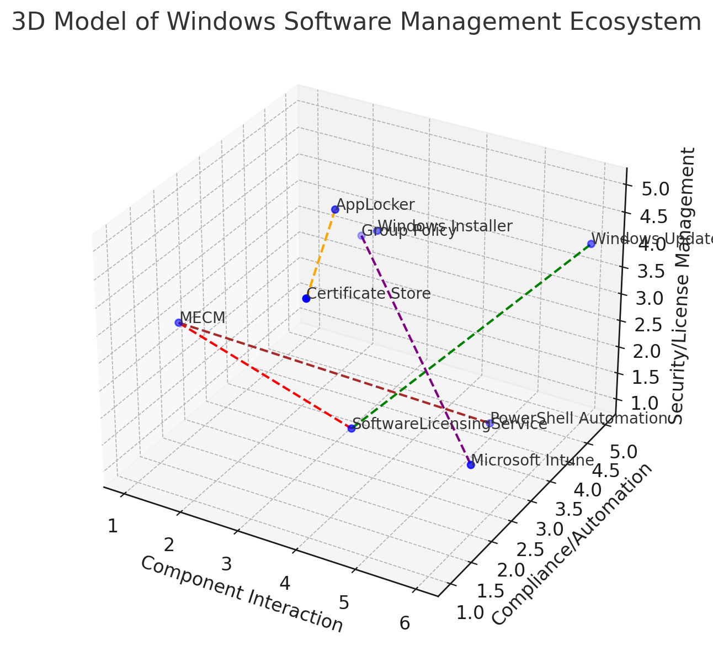

## Legenda:

1. **MECM**: Zarządza wdrażaniem i aktualizacjami oprogramowania.
2. **SoftwareLicensingService**: Obsługuje aktywację licencji i zgodność.
3. **AppLocker**: Zapewnia bezpieczeństwo aplikacji poprzez kontrolowanie dostępu do plików wykonywalnych.
4. **Windows Update**: Automatyzuje aktualizacje systemu operacyjnego i zarządzanie poprawkami.
5. **Group Policy**: Zarządza ustawieniami systemowymi i zasadami bezpieczeństwa.
6. **PowerShell Automation**: Wykonuje skrypty do zarządzania oprogramowaniem.
7. **Windows Installer**: Obsługuje instalację oprogramowania i zarządzanie wersjami.
8. **Certificate Store**: Weryfikuje autentyczność plików wykonywalnych.
9. **Microsoft Intune**: Obsługuje zdalne zarządzanie urządzeniami i oprogramowaniem, szczególnie w środowiskach chmurowych.

## Spis Treści

1. [Wprowadzenie](#wprowadzenie)
2. [Przegląd Ekosystemu Zarządzania Oprogramowaniem Windows](#przegląd-ekosystemu-zarządzania-oprogramowaniem-windows)
3. [Kluczowe Składowe Ekosystemu Windows](#kluczowe-składowe-ekosystemu-windows)
   - [Microsoft Endpoint Configuration Manager (MECM/SCCM)](#1-microsoft-endpoint-configuration-manager-mecmsccm)
   - [SoftwareLicensingService (SLS)](#2-softwarelicensingservice-sls)
   - [Windows Management Instrumentation (WMI)](#3-windows-management-instrumentation-wmi)
   - [Windows Update (WU)](#4-windows-update-wu)
   - [Windows Installer (MSI)](#5-windows-installer-msi)
   - [Group Policy (GP)](#6-group-policy-gp)
   - [Windows Deployment Services (WDS)](#7-windows-deployment-services-wds)
   - [PowerShell](#8-powershell)
   - [Windows Autopilot](#9-windows-autopilot)
   - [Azure Active Directory (Azure AD)](#10-azure-active-directory-azure-ad)
   - [Microsoft Intune](#11-microsoft-intune)
   - [Windows Defender Application Control (WDAC)](#12-windows-defender-application-control-wdac)
   - [Asset Intelligence](#13-asset-intelligence)
   - [Software Metering](#14-software-metering)
   - [Microsoft 365 (dawniej Office 365)](#15-microsoft-365-dawniej-office-365)
   - [Microsoft Store for Business](#16-microsoft-store-for-business)
4. [AppLocker: Rola i Funkcje](#applocker-rola-i-funkcje)
5. [Integracja Usług Systemowych Windows w MECM i SLS](#integracja-usług-systemowych-windows-w-mecm-i-sls)
6. [Praktyki Zarządzania](#praktyki-zarządzania)
7. [Przyszłość Zarządzania Oprogramowaniem w Windows](#przyszłość-zarządzania-oprogramowaniem-w-windows)
8. [Dodatkowe Rozważania](#dodatkowe-rozwazania)
9. [Przykłady Implementacji](#przykłady-implementacji)
10. [Podsumowanie](#podsumowanie)

---

## Wprowadzenie

Zarządzanie oprogramowaniem w środowisku Windows wymaga efektywnych narzędzi do aktualizacji systemów, współpracy z różnymi usługami oraz automatyzacji procesów licencyjnych. Kluczowymi elementami tego ekosystemu są **Microsoft Endpoint Configuration Manager (MECM)** oraz **SoftwareLicensingService**, które w połączeniu z **Windows Management Instrumentation (WMI)** umożliwiają kompleksowe zarządzanie licencjami oraz kontrolę nad oprogramowaniem w organizacji. Dodatkowo, **AppLocker** odgrywa istotną rolę w zapewnianiu bezpieczeństwa aplikacji.

## Przegląd Ekosystemu Zarządzania Oprogramowaniem Windows

Ekosystem zarządzania oprogramowaniem Windows obejmuje szereg narzędzi i usług, które współpracują ze sobą, aby zapewnić efektywne zarządzanie, aktualizacje, bezpieczeństwo oraz zgodność licencyjną. Poniżej przedstawiono kluczowe składowe tego ekosystemu.

## Kluczowe Składowe Ekosystemu Windows

### 1. Microsoft Endpoint Configuration Manager (MECM/SCCM)

**Opis:** MECM, wcześniej znany jako System Center Configuration Manager (SCCM), jest potężnym narzędziem do zarządzania infrastrukturą IT w organizacjach. Umożliwia instalację oprogramowania, zarządzanie aktualizacjami, monitorowanie stanu systemów oraz zarządzanie politykami konfiguracyjnymi na komputerach w sieci.

**Funkcje:**
- **Dystrybucja oprogramowania:** Automatyczne instalowanie aplikacji na komputerach klienckich.
- **Zarządzanie aktualizacjami:** Centralne zarządzanie i dystrybucja aktualizacji systemu operacyjnego oraz aplikacji.
- **Monitorowanie stanu systemów:** Śledzenie stanu zdrowia i wydajności urządzeń w sieci.
- **Zarządzanie konfiguracją:** Definiowanie i egzekwowanie polityk konfiguracyjnych.
- **Integracja z usługami zarządzającymi licencjami i oprogramowaniem:** Współpraca z SoftwareLicensingService i innymi usługami.

### 2. SoftwareLicensingService (SLS)

**Opis:** SoftwareLicensingService to klasa WMI w systemie Windows odpowiedzialna za zarządzanie licencjami systemu operacyjnego oraz zainstalowanego oprogramowania. Zapewnia funkcje związane z instalacją kluczy produktu, monitorowaniem aktywacji oraz zdalnym zarządzaniem licencjami.

**Funkcje:**
- **Instalacja kluczy licencyjnych (`InstallProductKey`):** Automatyczne wprowadzanie kluczy produktu.
- **Sprawdzanie statusu licencji (`GetActivationStatus`):** Monitorowanie stanu aktywacji oprogramowania.
- **Zdalne zarządzanie licencjami:** Centralne administrowanie licencjami bez fizycznego dostępu do urządzeń.

### 3. Windows Management Instrumentation (WMI)

**Opis:** WMI jest natywnym interfejsem Windows umożliwiającym zarządzanie i monitorowanie zasobów systemu. WMI jest wykorzystywane przez narzędzia takie jak MECM do zarządzania licencjami, konfiguracją i stanem systemów.

**Funkcje:**
- **Udostępnianie danych o stanie systemu:** Dostęp do informacji o sprzęcie i oprogramowaniu.
- **Automatyzacja zadań administracyjnych:** Wykonywanie skryptów i automatyzacja procesów.
- **Interakcja z innymi narzędziami systemowymi:** Integracja z PowerShell i innymi narzędziami.

### 4. Windows Update (WU)

**Opis:** Windows Update to usługa systemowa odpowiedzialna za instalację i zarządzanie aktualizacjami systemu operacyjnego oraz oprogramowania w Windows.

**Funkcje:**
- **Automatyczna instalacja aktualizacji systemowych:** Regularne pobieranie i instalowanie poprawek.
- **Zarządzanie cyklami życia aktualizacji:** Planowanie wdrożeń aktualizacji.
- **Integracja z narzędziami do zarządzania aktualizacjami:** Współpraca z MECM.

### 5. Windows Installer (MSI)

**Opis:** Windows Installer to usługa instalacyjna w Windows, która zapewnia narzędzia i procesy instalacji, naprawy oraz usuwania aplikacji z systemu.

**Funkcje:**
- **Instalacja i aktualizacja aplikacji korzystających z pakietów MSI:** Automatyzacja procesu instalacji.
- **Rejestrowanie zainstalowanego oprogramowania w systemie:** Umożliwia zarządzanie wersjami oprogramowania.
- **Automatyzacja instalacji aplikacji w środowiskach organizacji:** Integracja z MECM.

### 6. Group Policy (GP)

**Opis:** Group Policy to mechanizm centralnego zarządzania konfiguracją systemów Windows w środowiskach domenowych. Umożliwia definiowanie polityk instalacji oprogramowania, konfiguracji systemu oraz zabezpieczeń.

**Funkcje:**
- **Zarządzanie instalacją oprogramowania w sieci:** Automatyczne wdrażanie aplikacji.
- **Automatyzacja konfiguracji i ustawień systemowych:** Definiowanie standardów konfiguracyjnych.
- **Zastosowanie polityk zabezpieczeń i konfiguracji dla użytkowników i komputerów:** Utrzymanie zgodności z politykami firmy.

### 7. Windows Deployment Services (WDS)

**Opis:** Windows Deployment Services to narzędzie umożliwiające zdalną instalację systemów operacyjnych i oprogramowania na urządzeniach w sieci za pomocą obrazów systemowych.

**Funkcje:**
- **Tworzenie i dystrybucja obrazów systemowych:** Przygotowanie standardowych konfiguracji systemów.
- **Zdalne wdrażanie systemów operacyjnych:** Automatyzacja procesu instalacji.
- **Integracja z narzędziami takimi jak MECM:** Współpraca z innymi usługami zarządzającymi.

### 8. PowerShell

**Opis:** PowerShell to natywny język skryptowy i narzędzie administracyjne w Windows, wykorzystywane do automatyzacji zadań, zarządzania systemem i interakcji z WMI.

**Funkcje:**
- **Automatyzacja zadań administracyjnych:** Tworzenie skryptów do rutynowych zadań.
- **Tworzenie skryptów do zarządzania oprogramowaniem i licencjami:** Integracja z MECM i SLS.
- **Integracja z narzędziami zarządzającymi:** Współpraca z MECM, WMI i innymi usługami.

### 9. Windows Autopilot

**Opis:** Windows Autopilot to usługa, która upraszcza wdrażanie nowych urządzeń, umożliwiając ich automatyczną konfigurację i instalację oprogramowania.

**Funkcje:**
- **Automatyczna konfiguracja urządzeń w organizacjach:** Szybkie wdrożenie nowych sprzętów.
- **Integracja z usługami chmurowymi (Microsoft 365, Intune):** Zdalne zarządzanie i konfiguracja.
- **Zdalne zarządzanie oprogramowaniem i licencjami:** Ułatwia zarządzanie na dużą skalę.

### 10. Azure Active Directory (Azure AD)

**Opis:** Azure Active Directory to chmurowa usługa tożsamości, umożliwiająca zarządzanie użytkownikami i ich dostępem do aplikacji oraz zasobów, zarówno lokalnych, jak i chmurowych.

**Funkcje:**
- **Zarządzanie dostępem do aplikacji i licencjami w chmurze:** Kontrola dostępu do zasobów.
- **Integracja z narzędziami zarządzania licencjami (np. Microsoft Intune):** Centralizacja zarządzania.
- **Uwierzytelnianie i autoryzacja w środowiskach hybrydowych:** Bezpieczeństwo dostępu.

### 11. Microsoft Intune

**Opis:** Microsoft Intune to usługa chmurowa do zarządzania urządzeniami mobilnymi (MDM) i aplikacjami, w tym zarządzania oprogramowaniem i licencjami.

**Funkcje:**
- **Zarządzanie licencjami oprogramowania w środowisku chmurowym i hybrydowym:** Elastyczność zarządzania.
- **Monitorowanie i aktualizowanie aplikacji na urządzeniach mobilnych:** Utrzymanie aktualności oprogramowania.
- **Integracja z MECM:** Spójność zarządzania oprogramowaniem w różnych środowiskach.

### 12. Windows Defender Application Control (WDAC)

**Opis:** WDAC to mechanizm umożliwiający kontrolowanie, które aplikacje mogą być uruchamiane w systemie Windows, co zwiększa bezpieczeństwo i zgodność z politykami firmowymi.

**Funkcje:**
- **Definiowanie zasad uruchamiania aplikacji:** Kontrola dostępu do aplikacji.
- **Ochrona przed nieautoryzowanymi aplikacjami i zagrożeniami:** Zwiększenie bezpieczeństwa systemów.
- **Integracja z politykami zarządzania oprogramowaniem:** Spójność zabezpieczeń.

### 13. Asset Intelligence

**Opis:** Asset Intelligence to usługa dostępna w MECM, która umożliwia monitorowanie i zarządzanie zasobami IT, w tym oprogramowaniem, co wspiera optymalizację licencji.

**Funkcje:**
- **Śledzenie zasobów oprogramowania:** Monitorowanie zainstalowanego oprogramowania.
- **Optymalizacja kosztów licencyjnych poprzez monitorowanie użycia aplikacji:** Efektywne zarządzanie licencjami.

### 14. Software Metering

**Opis:** Software Metering to funkcja wbudowana w MECM, która umożliwia monitorowanie użycia oprogramowania w organizacji.

**Funkcje:**
- **Monitorowanie rzeczywistego użycia aplikacji:** Analiza wykorzystania oprogramowania.
- **Pomoc w optymalizacji licencji na podstawie rzeczywistego wykorzystania:** Redukcja kosztów licencyjnych.

### 15. Microsoft 365 (dawniej Office 365)

**Opis:** Microsoft 365 to platforma chmurowa oferująca usługi produktywności, zintegrowana z narzędziami zarządzania licencjami i użytkownikami w środowisku Windows.

**Funkcje:**
- **Zarządzanie subskrypcjami i licencjami aplikacji:** Centralizacja zarządzania licencjami.
- **Centralne zarządzanie oprogramowaniem w chmurze:** Ułatwienie administracji.

### 16. Microsoft Store for Business

**Opis:** Microsoft Store for Business to platforma umożliwiająca organizacjom zarządzanie zakupami, dystrybucją i licencjonowaniem aplikacji z Microsoft Store.

**Funkcje:**
- **Centralne zakupy i dystrybucja aplikacji:** Ułatwienie procesu zakupowego.
- **Zarządzanie licencjami aplikacji zakupionych przez firmę:** Kontrola nad wykorzystaniem licencji.

## AppLocker: Rola i Funkcje

**Opis:** AppLocker jest składnikiem systemu Windows, który zapewnia bezpieczeństwo aplikacji poprzez kontrolowanie dostępu do plików wykonywalnych. Jest to narzędzie umożliwiające administratorom definiowanie zasad, które określają, które aplikacje mogą być uruchamiane na komputerach w organizacji.

**Rola w Ekosystemie:**
- **Element składowy:** AppLocker jest częścią mechanizmów bezpieczeństwa Windows, integrując się z Group Policy oraz innymi usługami zarządzania oprogramowaniem.
- **Funkcja:** Zapewnienie, że tylko zatwierdzone aplikacje mogą być uruchamiane, co zwiększa bezpieczeństwo systemów poprzez ograniczenie ryzyka uruchomienia złośliwego oprogramowania.

**Funkcje:**
- **Definiowanie zasad uruchamiania aplikacji:** Administratorzy mogą tworzyć reguły bazujące na nazwach plików, wydawcach lub ścieżkach, aby kontrolować dostęp do aplikacji.
- **Ochrona przed nieautoryzowanymi aplikacjami:** Zapobieganie uruchamianiu aplikacji, które nie są zatwierdzone przez organizację.
- **Integracja z politykami zarządzania oprogramowaniem:** Współpraca z Group Policy umożliwia scentralizowane zarządzanie zasadami bezpieczeństwa aplikacji.

## Integracja Usług Systemowych Windows w MECM i SLS

Integracja usług systemowych Windows, takich jak **MECM** i **SoftwareLicensingService (SLS)**, odgrywa kluczową rolę w efektywnym zarządzaniu oprogramowaniem, licencjonowaniem oraz bezpieczeństwem w organizacjach. Poniżej przedstawiono główne aspekty tej integracji.

### Automatyzacja Procesów Zarządzania

- **Instalacja i Aktywacja Licencji:** Dzięki integracji MECM z SLS przez WMI, proces instalacji i aktywacji kluczy licencyjnych może być całkowicie zautomatyzowany. Administratorzy mogą definiować skrypty PowerShell w MECM, które automatycznie wprowadzają klucze licencyjne na nowych lub istniejących urządzeniach, eliminując potrzebę ręcznej interwencji.
  
- **Automatyczne Wdrażanie Aktualizacji:** MECM zarządza aktualizacjami systemu operacyjnego i oprogramowania, wykorzystując funkcje SLS do monitorowania zgodności licencyjnej po każdej aktualizacji. Dzięki temu aktualizacje są nie tylko wdrażane automatycznie, ale również sprawdzane pod kątem zgodności z licencjami.

### Monitorowanie i Raportowanie

- **Zgodność Licencyjna:** Integracja MECM z SLS umożliwia ciągłe monitorowanie stanu licencji w organizacji. MECM korzysta z danych dostarczanych przez SLS poprzez WMI, aby generować raporty zgodności licencyjnej, identyfikować urządzenia z niewłaściwymi licencjami i automatycznie tworzyć alerty dla administratorów.

- **Monitorowanie Stanu Systemów:** WMI dostarcza MECM informacji na temat stanu zdrowia systemów i aplikacji. Dzięki temu MECM może proaktywnie identyfikować i rozwiązywać problemy przed ich eskalacją, zapewniając ciągłość działania i minimalizując przestoje.

### Centralne Zarządzanie

- **Zarządzanie Zasobami IT:** MECM integruje się z usługami takimi jak Asset Intelligence i Software Metering, umożliwiając centralne zarządzanie zasobami IT. Scentralizowane zarządzanie zasobami pozwala na lepszą kontrolę nad licencjami, optymalizację kosztów oraz efektywne wykorzystanie dostępnych zasobów.

- **Polityki Konfiguracyjne:** Dzięki integracji z Group Policy oraz innymi narzędziami konfiguracyjnymi, MECM umożliwia centralne definiowanie i egzekwowanie polityk konfiguracyjnych na wszystkich urządzeniach w sieci. To zapewnia zgodność z wewnętrznymi standardami oraz wymogami regulacyjnymi.

### Bezpieczeństwo i Zgodność

- **Kontrola Aplikacji:** Integracja MECM z Windows Defender Application Control (WDAC) oraz AppLocker pozwala na kontrolowanie, które aplikacje mogą być uruchamiane na urządzeniach w organizacji. To zwiększa bezpieczeństwo systemów, chroniąc je przed nieautoryzowanymi i potencjalnie złośliwymi aplikacjami.

- **Zarządzanie Zgodnością z Regulacjami:** MECM, w połączeniu z SLS i innymi usługami, umożliwia organizacjom utrzymanie zgodności z regulacjami prawnymi dotyczącymi zarządzania oprogramowaniem i danymi, takimi jak GDPR czy HIPAA. Dzięki automatyzacji procesów zarządzania licencjami i aktualizacjami, organizacje mogą łatwiej spełniać wymogi prawne i audytowe.

### Współpraca z Usługami Chmurowymi

- **Integracja z Azure AD i Intune:** MECM współpracuje z usługami chmurowymi takimi jak Azure Active Directory i Microsoft Intune, co umożliwia zarządzanie oprogramowaniem i licencjami zarówno w środowiskach lokalnych, jak i chmurowych. Ta integracja zapewnia elastyczność i skalowalność zarządzania oprogramowaniem w dynamicznie zmieniających się środowiskach IT.

### Skalowalność i Elastyczność

- **Zarządzanie Dużymi Środowiskami:** Integracja MECM z SLS poprzez WMI umożliwia efektywne zarządzanie licencjami i oprogramowaniem w dużych środowiskach IT. Centralne zarządzanie i automatyzacja procesów pozwala na skalowanie działań zarządzających oprogramowaniem bez zwiększania nakładu pracy administracyjnej.

- **Elastyczność w Zarządzaniu Oprogramowaniem:** MECM pozwala na zarządzanie różnymi typami oprogramowania i licencji, w tym aplikacji SaaS, tradycyjnych aplikacji desktopowych oraz aplikacji mobilnych. Integracja z SLS i innymi usługami systemowymi zapewnia elastyczność w zarządzaniu różnorodnym oprogramowaniem w organizacji.

## Praktyki Zarządzania

### Automatyzacja Zarządzania Licencjami

- **Skrypty PowerShell:** Użycie skryptów PowerShell w MECM do automatycznego instalowania i aktualizacji kluczy licencyjnych. PowerShell umożliwia tworzenie zaawansowanych skryptów, które mogą integrować się z innymi systemami oraz automatyzować skomplikowane procesy zarządzania licencjami.

- **Zadania Planowane:** Tworzenie zadań w MECM, które regularnie sprawdzają status licencji i generują raporty. Zadania planowane mogą działać w określonych interwałach czasowych, co zapewnia ciągłe monitorowanie zgodności licencyjnej.

- **Integracja z Systemami ITSM:** Połączenie MECM z systemami zarządzania usługami IT (ITSM) umożliwia automatyczne zgłaszanie i śledzenie problemów związanych z licencjami. Integracja ta pozwala na lepszą koordynację działań IT oraz szybsze rozwiązywanie problemów licencyjnych.

### Bezpieczeństwo i Zgodność

- **Monitorowanie Nieautoryzowanych Instalacji:** Dzięki integracji z SoftwareLicensingService, MECM może wykrywać i raportować nieautoryzowane instalacje oprogramowania. Szybkie wykrywanie nielegalnych instalacji pozwala na szybkie reagowanie i eliminowanie potencjalnych zagrożeń bezpieczeństwa.

- **Egzekwowanie Polityk Licencyjnych:** Automatyczne wdrażanie polityk licencyjnych, które zapewniają, że wszystkie oprogramowanie jest legalnie licencjonowane. Polityki te mogą definiować zasady instalacji, użytkowania oraz aktualizacji oprogramowania, co pomaga w utrzymaniu zgodności z przepisami.

- **Ochrona Przed Atakami:** Aktualizacje i patche zarządzane przez MECM pomagają w zabezpieczeniu systemów przed zagrożeniami. Regularne aktualizacje zmniejszają ryzyko wykorzystania luk bezpieczeństwa przez złośliwe oprogramowanie oraz inne zagrożenia cybernetyczne.

## Przyszłość Zarządzania Oprogramowaniem w Windows

Zarządzanie oprogramowaniem w ekosystemie Windows będzie nadal ewoluować, odpowiadając na zmieniające się potrzeby organizacji oraz rozwój technologii:

- **Sztuczna Inteligencja i Uczenie Maszynowe:** Integracja AI i ML z narzędziami zarządzania oprogramowaniem umożliwi predykcyjne analizy oraz automatyzację bardziej złożonych procesów zarządzania licencjami i aktualizacjami.

- **Zarządzanie Oprogramowaniem jako Usługą (SaaS):** Wzrost popularności aplikacji SaaS wymaga bardziej elastycznych modeli zarządzania licencjami oraz integracji z usługami chmurowymi.

- **Zwiększona Automatyzacja:** Automatyzacja będzie kluczowym elementem przyszłości zarządzania oprogramowaniem, umożliwiając jeszcze większą efektywność oraz redukcję kosztów operacyjnych.

- **Bezpieczeństwo i Zgodność:** W obliczu rosnących zagrożeń cybernetycznych, zarządzanie oprogramowaniem będzie coraz bardziej skoncentrowane na bezpieczeństwie oraz zgodności z regulacjami prawnymi.

## Dodatkowe Rozważania

Aby jeszcze lepiej zrozumieć zarządzanie oprogramowaniem w ekosystemie Windows, warto rozważyć kilka dodatkowych aspektów:

- **Zarządzanie Cyfrowym Śladem:** Organizacje muszą zarządzać swoim cyfrowym śladem, czyli informacjami o wszystkich zainstalowanych aplikacjach i systemach. MECM i SoftwareLicensingService umożliwiają dokładne śledzenie tych informacji, co jest kluczowe dla zarządzania zasobami oraz zgodności z przepisami.

- **Zarządzanie Zgodnością z Regulacjami:** Wiele branż jest regulowanych prawnie pod względem zarządzania danymi i oprogramowaniem. Narzędzia zarządzania oprogramowaniem muszą wspierać organizacje w utrzymaniu zgodności z regulacjami, takimi jak GDPR, HIPAA czy inne specyficzne dla danej branży.

- **Zarządzanie Zdalnymi Urządzeniami:** W dobie pracy zdalnej, zarządzanie oprogramowaniem na zdalnych urządzeniach staje się coraz ważniejsze. MECM wspiera zarządzanie urządzeniami niezależnie od ich lokalizacji, co jest kluczowe dla utrzymania spójności i bezpieczeństwa w dynamicznie zmieniającym się środowisku pracy.

- **Użytkownik Końcowy jako Klient:** Zarządzanie oprogramowaniem musi uwzględniać doświadczenie użytkownika końcowego. Intuicyjne interfejsy, minimalne zakłócenia podczas aktualizacji oraz szybki dostęp do wsparcia technicznego są kluczowe dla utrzymania wysokiego poziomu satysfakcji użytkowników.

- **Zarządzanie Zasobami Chmurowymi:** Coraz więcej organizacji korzysta z zasobów chmurowych. Integracja zarządzania oprogramowaniem z zasobami chmurowymi, takimi jak Azure, umożliwia bardziej elastyczne i skalowalne podejście do zarządzania licencjami oraz aplikacjami.

## Przykłady Implementacji

Aby lepiej zrozumieć praktyczne zastosowanie narzędzi zarządzania oprogramowaniem w ekosystemie Windows, warto przeanalizować kilka przykładów implementacji:

- **Automatyczne Wdrażanie Aktualizacji:** Firma X wykorzystuje MECM do automatycznego wdrażania aktualizacji systemu operacyjnego oraz aplikacji na wszystkich urządzeniach w sieci. Dzięki temu minimalizuje czas przestojów oraz zapewnia, że wszystkie systemy są aktualne i zabezpieczone przed najnowszymi zagrożeniami.

- **Centralne Zarządzanie Licencjami:** Organizacja Y korzysta z integracji MECM z SoftwareLicensingService do centralnego zarządzania licencjami oprogramowania. Automatyczne instalowanie kluczy licencyjnych oraz regularne monitorowanie zgodności licencyjnej pozwala na optymalizację kosztów oraz uniknięcie problemów związanych z audytami licencyjnymi.

- **Optymalizacja Wykorzystania Oprogramowania:** Firma Z używa Software Metering w MECM do monitorowania wykorzystania oprogramowania. Analiza danych pozwala na identyfikację niewykorzystywanych aplikacji, co umożliwia redukcję liczby zakupionych licencji oraz oszczędności kosztów.

## Podsumowanie

Zarządzanie oprogramowaniem w ekosystemie Windows, z wykorzystaniem **MECM** i **SoftwareLicensingService**, oferuje kompleksowe rozwiązania dla organizacji dążących do efektywnego zarządzania licencjami, aktualizacjami i bezpieczeństwem systemów. Integracja z **WMI** oraz narzędziami takimi jak **Asset Intelligence** i **Software Metering** umożliwia automatyzację procesów, zwiększając zgodność licencyjną i optymalizując koszty. Dzięki ciągłemu rozwojowi narzędzi zarządzania, organizacje mogą lepiej dostosować się do dynamicznych wymagań środowiska IT, zapewniając jednocześnie bezpieczeństwo i zgodność z politykami firmy.

**AppLocker**, jako kluczowy komponent bezpieczeństwa, odgrywa istotną rolę w kontrolowaniu, które aplikacje mogą być uruchamiane w systemie, co dodatkowo zwiększa poziom ochrony przed zagrożeniami. Integracja tych narzędzi i usług pozwala na skuteczne zarządzanie zasobami IT, minimalizowanie ryzyka związanego z niezgodnością licencyjną oraz zapewnianie wysokiej jakości usług dla użytkowników końcowych.

Ewolucja zarządzania licencjami od Windows Vista do najnowszych wersji systemu Windows pokazuje, jak technologie zarządzania oprogramowaniem stają się coraz bardziej zaawansowane i zintegrowane z innymi usługami IT. Przyszłość zarządzania oprogramowaniem w ekosystemie Windows zapowiada się jeszcze bardziej zautomatyzowana, bezpieczna i elastyczna, co pozwoli organizacjom na skuteczne reagowanie na zmieniające się potrzeby biznesowe oraz technologiczne.

---

## Dodatkowe Rozważania

Aby jeszcze lepiej zrozumieć zarządzanie oprogramowaniem w ekosystemie Windows, warto rozważyć kilka dodatkowych aspektów:

- **Zarządzanie Cyfrowym Śladem:** Organizacje muszą zarządzać swoim cyfrowym śladem, czyli informacjami o wszystkich zainstalowanych aplikacjach i systemach. MECM i SoftwareLicensingService umożliwiają dokładne śledzenie tych informacji, co jest kluczowe dla zarządzania zasobami oraz zgodności z przepisami.

- **Zarządzanie Zgodnością z Regulacjami:** Wiele branż jest regulowanych prawnie pod względem zarządzania danymi i oprogramowaniem. Narzędzia zarządzania oprogramowaniem muszą wspierać organizacje w utrzymaniu zgodności z regulacjami, takimi jak GDPR, HIPAA czy inne specyficzne dla danej branży.

- **Zarządzanie Zdalnymi Urządzeniami:** W dobie pracy zdalnej, zarządzanie oprogramowaniem na zdalnych urządzeniach staje się coraz ważniejsze. MECM wspiera zarządzanie urządzeniami niezależnie od ich lokalizacji, co jest kluczowe dla utrzymania spójności i bezpieczeństwa w dynamicznie zmieniającym się środowisku pracy.

- **Użytkownik Końcowy jako Klient:** Zarządzanie oprogramowaniem musi uwzględniać doświadczenie użytkownika końcowego. Intuicyjne interfejsy, minimalne zakłócenia podczas aktualizacji oraz szybki dostęp do wsparcia technicznego są kluczowe dla utrzymania wysokiego poziomu satysfakcji użytkowników.

- **Zarządzanie Zasobami Chmurowymi:** Coraz więcej organizacji korzysta z zasobów chmurowych. Integracja zarządzania oprogramowaniem z zasobami chmurowymi, takimi jak Azure, umożliwia bardziej elastyczne i skalowalne podejście do zarządzania licencjami oraz aplikacjami.

## Przykłady Implementacji

Aby lepiej zrozumieć praktyczne zastosowanie narzędzi zarządzania oprogramowaniem w ekosystemie Windows, warto przeanalizować kilka przykładów implementacji:

- **Automatyczne Wdrażanie Aktualizacji:** Firma X wykorzystuje MECM do automatycznego wdrażania aktualizacji systemu operacyjnego oraz aplikacji na wszystkich urządzeniach w sieci. Dzięki temu minimalizuje czas przestojów oraz zapewnia, że wszystkie systemy są aktualne i zabezpieczone przed najnowszymi zagrożeniami.

- **Centralne Zarządzanie Licencjami:** Organizacja Y korzysta z integracji MECM z SoftwareLicensingService do centralnego zarządzania licencjami oprogramowania. Automatyczne instalowanie kluczy licencyjnych oraz regularne monitorowanie zgodności licencyjnej pozwala na optymalizację kosztów oraz uniknięcie problemów związanych z audytami licencyjnymi.

- **Optymalizacja Wykorzystania Oprogramowania:** Firma Z używa Software Metering w MECM do monitorowania wykorzystania oprogramowania. Analiza danych pozwala na identyfikację niewykorzystywanych aplikacji, co umożliwia redukcję liczby zakupionych licencji oraz oszczędności kosztów.

## Podsumowanie

Zarządzanie oprogramowaniem w ekosystemie Windows jest złożonym procesem, który wymaga zastosowania zaawansowanych narzędzi oraz strategii. **Microsoft Endpoint Configuration Manager (MECM)** oraz **SoftwareLicensingService**, w połączeniu z **Windows Management Instrumentation (WMI)**, oferują kompleksowe rozwiązania umożliwiające efektywne zarządzanie licencjami, aktualizacjami oraz bezpieczeństwem systemów. **AppLocker**, jako kluczowy komponent bezpieczeństwa, dodatkowo zwiększa ochronę przed nieautoryzowanym oprogramowaniem.

Integracja z innymi usługami, takimi jak **Asset Intelligence**, **Software Metering**, **Azure AD** czy **Microsoft Intune**, dodatkowo wzbogaca możliwości zarządzania, zapewniając elastyczność i skalowalność w dynamicznym środowisku IT. Automatyzacja procesów zarządzania licencjami oraz aktualizacjami jest kluczowa dla zwiększenia efektywności operacyjnej i redukcji ryzyka błędów. Dzięki narzędziom takim jak MECM, organizacje mogą centralnie zarządzać swoim oprogramowaniem, zapewniając zgodność z politykami licencyjnymi oraz bezpieczeństwo systemów.

Przyszłość zarządzania oprogramowaniem w ekosystemie Windows zapowiada się obiecująco, z rosnącym naciskiem na automatyzację, integrację z chmurą oraz wykorzystanie zaawansowanych technologii, takich jak sztuczna inteligencja. Organizacje, które skutecznie wdrożą nowoczesne narzędzia zarządzania oprogramowaniem, będą lepiej przygotowane na wyzwania związane z dynamicznie zmieniającym się środowiskiem IT, zapewniając jednocześnie wysoką jakość usług oraz zgodność z regulacjami prawnymi.

---

# Kluczowe Składowe Ekosystemu Windows w Zarządzaniu Oprogramowaniem

W kontekście zarządzania oprogramowaniem, licencjonowania i współpracy systemu operacyjnego Windows z kodem wykonywalnym, istotnymi składowymi ekosystemu są różnorodne usługi, narzędzia oraz interfejsy, które wspierają automatyzację, monitorowanie, instalację i zarządzanie oprogramowaniem. Oto kluczowe składowe ekosystemu Windows w tym zakresie:

### 1. Microsoft Endpoint Configuration Manager (MECM/SCCM)
- **Opis:** Narzędzie do zarządzania infrastrukturą IT, które umożliwia instalację oprogramowania, zarządzanie aktualizacjami, monitorowanie stanu systemów oraz zarządzanie politykami konfiguracyjnymi na komputerach w sieci. MECM to narzędzie zarządzające wdrożeniami, aktualizacjami oraz licencjami. Zintegrowane z WMI, jest w stanie wykonywać szeroki zakres działań na systemach klienckich bez konieczności interakcji użytkownika końcowego. MECM pozwala na centralne zarządzanie systemami, co minimalizuje ryzyko niezgodności licencyjnych, błędów manualnych oraz problemów związanych z bezpieczeństwem (np. brak aktualizacji). To kluczowy element ekosystemu Windows, szczególnie w dużych organizacjach, gdzie zarządzanie setkami lub tysiącami urządzeń jest koniecznością.
- **Funkcje:**
  - Dystrybucja oprogramowania
  - Zarządzanie aktualizacjami
  - Monitorowanie stanu systemów
  - Zarządzanie konfiguracją
  - Integracja z usługami zarządzającymi licencjami i oprogramowaniem

### 2. SoftwareLicensingService (SLS)
- **Opis:** Usługa WMI odpowiedzialna za zarządzanie licencjami systemu operacyjnego oraz oprogramowania. Zapewnia funkcje związane z instalacją kluczy produktu, monitorowaniem aktywacji i zdalnym zarządzaniem licencjami. SoftwareLicensingService to usługa systemowa działająca na poziomie WMI, odpowiedzialna za zarządzanie licencjami oprogramowania. Zapewnia zdalną instalację kluczy licencyjnych, monitorowanie aktywacji i zgodności licencyjnej. Jest to kluczowy element w dużych organizacjach, ponieważ umożliwia zautomatyzowane zarządzanie licencjami oraz szybkie wykrywanie nieautoryzowanych lub nieaktywowanych instalacji.
- **Funkcje:**
  - Instalacja kluczy licencyjnych (`InstallProductKey`)
  - Sprawdzanie statusu licencji (`GetActivationStatus`)
  - Zdalne zarządzanie licencjami

### 3. Windows Management Instrumentation (WMI)
- **Opis:** Natywny interfejs Windows umożliwiający zarządzanie i monitorowanie zasobów systemu. WMI jest wykorzystywane przez narzędzia takie jak MECM do zarządzania licencjami, konfiguracją i stanem systemów. WMI jest centralnym elementem, który umożliwia interakcję z systemem operacyjnym na poziomie zarządzania i monitorowania. Obsługuje szereg operacji, takich jak zdalne zarządzanie licencjami, monitorowanie stanu oprogramowania, a także współpracę z narzędziami do automatyzacji, takimi jak PowerShell. Usługa ta działa jako warstwa abstrakcji, umożliwiając różnym narzędziom natywnym (np. MECM) oraz zewnętrznym aplikacjom dostęp do danych i operacji na systemie operacyjnym.
- **Funkcje:**
  - Udostępnianie danych o stanie systemu
  - Automatyzacja zadań administracyjnych
  - Interakcja z innymi narzędziami systemowymi (np. PowerShell)

### 4. Windows Update (WU)
- **Opis:** Usługa systemowa odpowiedzialna za instalację i zarządzanie aktualizacjami systemu operacyjnego oraz oprogramowania w Windows.
- **Funkcje:**
  - Automatyczna instalacja aktualizacji systemowych
  - Zarządzanie cyklami życia aktualizacji
  - Integracja z narzędziami do zarządzania aktualizacjami, takimi jak MECM

### 5. Windows Installer (MSI)
- **Opis:** Usługa instalacyjna w Windows, która zapewnia narzędzia i procesy instalacji, naprawy i usuwania aplikacji z systemu. MSI jest natywnym mechanizmem Windows do instalacji oprogramowania. Jest ściśle zintegrowany z narzędziami zarządzania, takimi jak MECM, i pozwala na automatyzację procesu instalacji, aktualizacji oraz usuwania aplikacji. MSI działa na poziomie warstwy aplikacji, a jego integracja z systemami zarządzania pozwala na kontrolowanie wersji i wdrażanie aplikacji w skali całej organizacji.
- **Funkcje:**
  - Instalacja i aktualizacja aplikacji korzystających z pakietów MSI
  - Rejestrowanie zainstalowanego oprogramowania w systemie
  - Automatyzacja instalacji aplikacji w środowiskach organizacji

### 6. Group Policy (GP)
- **Opis:** Mechanizm centralnego zarządzania konfiguracją systemów Windows w środowiskach domenowych. Umożliwia definiowanie polityk instalacji oprogramowania, konfiguracji systemu oraz zabezpieczeń.
- **Funkcje:**
  - Zarządzanie instalacją oprogramowania w sieci
  - Automatyzacja konfiguracji i ustawień systemowych
  - Zastosowanie polityk zabezpieczeń i konfiguracji dla użytkowników i komputerów

### 7. Windows Deployment Services (WDS)
- **Opis:** Narzędzie umożliwiające zdalną instalację systemów operacyjnych i oprogramowania na urządzeniach w sieci za pomocą obrazów systemowych.
- **Funkcje:**
  - Tworzenie i dystrybucja obrazów systemowych
  - Zdalne wdrażanie systemów operacyjnych
  - Integracja z narzędziami takimi jak MECM

### 8. PowerShell
- **Opis:** Natywny język skryptowy i narzędzie administracyjne w Windows, wykorzystywane do automatyzacji zadań, zarządzania systemem i interakcji z WMI.
- **Funkcje:**
  - Automatyzacja zadań administracyjnych
  - Tworzenie skryptów do zarządzania oprogramowaniem i licencjami
  - Integracja z narzędziami zarządzającymi, np. MECM i SoftwareLicensingService

### 9. Windows Autopilot
- **Opis:** Usługa, która upraszcza wdrażanie nowych urządzeń, umożliwiając ich automatyczną konfigurację i instalację oprogramowania.
- **Funkcje:**
  - Automatyczna konfiguracja urządzeń w organizacjach
  - Integracja z usługami chmurowymi (Microsoft 365, Intune)
  - Zdalne zarządzanie oprogramowaniem i licencjami

### 10. Azure Active Directory (Azure AD)
- **Opis:** Chmurowa usługa tożsamości, umożliwiająca zarządzanie użytkownikami i ich dostępem do aplikacji oraz zasobów, zarówno lokalnych, jak i chmurowych.
- **Funkcje:**
  - Zarządzanie dostępem do aplikacji i licencjami w chmurze
  - Integracja z narzędziami zarządzania licencjami, np. Microsoft Intune
  - Uwierzytelnianie i autoryzacja w środowiskach hybrydowych

### 11. Microsoft Intune
- **Opis:** Usługa chmurowa do zarządzania urządzeniami mobilnymi (MDM) i aplikacjami, w tym zarządzania oprogramowaniem i licencjami.
- **Funkcje:**
  - Zarządzanie licencjami oprogramowania w środowisku chmurowym i hybrydowym
  - Monitorowanie i aktualizowanie aplikacji na urządzeniach mobilnych
  - Integracja z MECM w ramach zarządzania oprogramowaniem

### 12. Windows Defender Application Control (WDAC)
- **Opis:** Mechanizm umożliwiający kontrolowanie, które aplikacje mogą być uruchamiane w systemie Windows, co zwiększa bezpieczeństwo i zgodność z politykami firmowymi.
- **Funkcje:**
  - Definiowanie zasad uruchamiania aplikacji
  - Ochrona przed nieautoryzowanymi aplikacjami i zagrożeniami
  - Integracja z politykami zarządzania oprogramowaniem

### 13. Asset Intelligence
- **Opis:** Usługa dostępna w MECM, która umożliwia monitorowanie i zarządzanie zasobami IT, w tym oprogramowaniem, co wspiera optymalizację licencji.
- **Funkcje:**
  - Śledzenie zasobów oprogramowania
  - Optymalizacja kosztów licencyjnych poprzez monitorowanie użycia aplikacji

### 14. Software Metering
- **Opis:** Funkcja wbudowana w MECM, która umożliwia monitorowanie użycia oprogramowania w organizacji.
- **Funkcje:**
  - Monitorowanie rzeczywistego użycia aplikacji
  - Pomoc w optymalizacji licencji na podstawie rzeczywistego wykorzystania

### 15. Microsoft 365 (dawniej Office 365)
- **Opis:** Platforma chmurowa oferująca usługi produktywności, zintegrowana z narzędziami zarządzania licencjami i użytkownikami w środowisku Windows.
- **Funkcje:**
  - Zarządzanie subskrypcjami i licencjami aplikacji
  - Centralne zarządzanie oprogramowaniem w chmurze

### 16. Microsoft Store for Business
- **Opis:** Platforma umożliwiająca organizacjom zarządzanie zakupami, dystrybucją i licencjonowaniem aplikacji z Microsoft Store.
- **Funkcje:**
  - Centralne zakupy i dystrybucja aplikacji
  - Zarządzanie licencjami aplikacji zakupionych przez firmę

---

## Rola Integracji Usług Systemowych Windows w MECM i SLS

Integracja usług systemowych Windows, takich jak **MECM** i **SLS**, odgrywa kluczową rolę w efektywnym zarządzaniu oprogramowaniem, licencjonowaniem oraz bezpieczeństwem w organizacjach. Poniżej przedstawiono główne aspekty tej integracji:

### Automatyzacja Procesów Zarządzania

- **Instalacja i Aktywacja Licencji:** Dzięki integracji MECM z SLS przez WMI, proces instalacji i aktywacji kluczy licencyjnych może być całkowicie zautomatyzowany. Administratorzy mogą definiować skrypty PowerShell w MECM, które automatycznie wprowadzają klucze licencyjne na nowych lub istniejących urządzeniach, eliminując potrzebę ręcznej interwencji.

- **Automatyczne Wdrażanie Aktualizacji:** MECM zarządza aktualizacjami systemu operacyjnego i oprogramowania, wykorzystując funkcje SLS do monitorowania zgodności licencyjnej po każdej aktualizacji. Dzięki temu aktualizacje są nie tylko wdrażane automatycznie, ale również sprawdzane pod kątem zgodności z licencjami.

### Monitorowanie i Raportowanie

- **Zgodność Licencyjna:** Integracja MECM z SLS umożliwia ciągłe monitorowanie stanu licencji w organizacji. MECM korzysta z danych dostarczanych przez SLS poprzez WMI, aby generować raporty zgodności licencyjnej, identyfikować urządzenia z niewłaściwymi licencjami i automatycznie tworzyć alerty dla administratorów.

- **Monitorowanie Stanu Systemów:** WMI dostarcza MECM informacji na temat stanu zdrowia systemów i aplikacji. Dzięki temu MECM może proaktywnie identyfikować i rozwiązywać problemy przed ich eskalacją, zapewniając ciągłość działania i minimalizując przestoje.

### Centralne Zarządzanie

- **Zarządzanie Zasobami IT:** MECM integruje się z usługami takimi jak Asset Intelligence i Software Metering, umożliwiając centralne zarządzanie zasobami IT. Scentralizowane zarządzanie zasobami pozwala na lepszą kontrolę nad licencjami, optymalizację kosztów oraz efektywne wykorzystanie dostępnych zasobów.

- **Polityki Konfiguracyjne:** Dzięki integracji z Group Policy oraz innymi narzędziami konfiguracyjnymi, MECM umożliwia centralne definiowanie i egzekwowanie polityk konfiguracyjnych na wszystkich urządzeniach w sieci. To zapewnia zgodność z wewnętrznymi standardami oraz wymogami regulacyjnymi.

### Bezpieczeństwo i Zgodność

- **Kontrola Aplikacji:** Integracja MECM z **Windows Defender Application Control (WDAC)** oraz **AppLocker** pozwala na kontrolowanie, które aplikacje mogą być uruchamiane na urządzeniach w organizacji. To zwiększa bezpieczeństwo systemów, chroniąc je przed nieautoryzowanymi i potencjalnie złośliwymi aplikacjami.

- **Zarządzanie Zgodnością z Regulacjami:** MECM, w połączeniu z SLS i innymi usługami, umożliwia organizacjom utrzymanie zgodności z regulacjami prawnymi dotyczącymi zarządzania oprogramowaniem i danymi, takimi jak GDPR czy HIPAA. Dzięki automatyzacji procesów zarządzania licencjami i aktualizacjami, organizacje mogą łatwiej spełniać wymogi prawne i audytowe.

### Współpraca z Usługami Chmurowymi

- **Integracja z Azure AD i Intune:** MECM współpracuje z usługami chmurowymi takimi jak Azure Active Directory i Microsoft Intune, co umożliwia zarządzanie oprogramowaniem i licencjami zarówno w środowiskach lokalnych, jak i chmurowych. Ta integracja zapewnia elastyczność i skalowalność zarządzania oprogramowaniem w dynamicznie zmieniających się środowiskach IT.

### Skalowalność i Elastyczność

- **Zarządzanie Dużymi Środowiskami:** Integracja MECM z SLS poprzez WMI umożliwia efektywne zarządzanie licencjami i oprogramowaniem w dużych środowiskach IT. Centralne zarządzanie i automatyzacja procesów pozwala na skalowanie działań zarządzających oprogramowaniem bez zwiększania nakładu pracy administracyjnej.

- **Elastyczność w Zarządzaniu Oprogramowaniem:** MECM pozwala na zarządzanie różnymi typami oprogramowania i licencji, w tym aplikacji SaaS, tradycyjnych aplikacji desktopowych oraz aplikacji mobilnych. Integracja z SLS i innymi usługami systemowymi zapewnia elastyczność w zarządzaniu różnorodnym oprogramowaniem w organizacji.

## Podsumowanie

Każda z wymienionych składowych ekosystemu Windows odgrywa istotną rolę w zarządzaniu oprogramowaniem, licencjami i procesami wdrażania aplikacji w środowisku IT. Integracja między tymi usługami, takimi jak **MECM**, **WMI**, **PowerShell** i **SoftwareLicensingService**, zapewnia szerokie możliwości automatyzacji oraz centralizacji zarządzania. W tym ekosystemie usługi chmurowe (**Azure AD**, **Intune**) i lokalne (**MECM**, **WMI**) współpracują, aby efektywnie zarządzać cyklem życia oprogramowania w dużych organizacjach.

**AppLocker** jako kluczowy komponent bezpieczeństwa odgrywa istotną rolę w kontrolowaniu, które aplikacje mogą być uruchamiane na urządzeniach w organizacji, co dodatkowo zwiększa poziom ochrony przed zagrożeniami.

Dzięki ciągłemu rozwojowi narzędzi zarządzania, organizacje mogą lepiej dostosować się do dynamicznych wymagań środowiska IT, zapewniając jednocześnie bezpieczeństwo i zgodność z politykami firmy.

---

# Rola AppLocker w Ekosystemie Windows

**AppLocker** jest jednym z kluczowych narzędzi bezpieczeństwa w ekosystemie zarządzania oprogramowaniem Windows. Umożliwia administratorom definiowanie, które aplikacje mogą być uruchamiane na komputerach w organizacji, co znacząco zwiększa bezpieczeństwo systemów poprzez ograniczenie możliwości uruchomienia nieautoryzowanego lub potencjalnie złośliwego oprogramowania.

## Funkcje AppLocker

1. **Kontrola Uruchamiania Aplikacji:**
   - **Definiowanie Reguł:** Administratorzy mogą tworzyć reguły bazujące na różnych kryteriach, takich jak nazwa pliku, wydawca (certyfikat wydawcy), ścieżka pliku czy hashe plików.
   - **Kategoryzacja Aplikacji:** Możliwość tworzenia zasad dla różnych typów aplikacji, takich jak pliki .exe, .msi, .script, .appx itp.

2. **Zwiększenie Bezpieczeństwa:**
   - **Ochrona przed Złośliwym Oprogramowaniem:** Ograniczenie uruchamiania nieznanych lub nieautoryzowanych aplikacji zmniejsza ryzyko infekcji malware.
   - **Zabezpieczenie Danych:** Kontrolując, które aplikacje mogą być uruchamiane, organizacje mogą lepiej chronić swoje zasoby i dane przed nieautoryzowanym dostępem.

3. **Integracja z Grupową Polityką (Group Policy):**
   - **Centralne Zarządzanie:** AppLocker jest zarządzany poprzez Group Policy, co umożliwia centralne definiowanie i egzekwowanie reguł bezpieczeństwa na wszystkich urządzeniach w domenie.
   - **Elastyczność Polityk:** Możliwość tworzenia różnych polityk dla różnych grup użytkowników i komputerów, dostosowując zasady do specyficznych potrzeb.

4. **Monitorowanie i Raportowanie:**
   - **Rejestrowanie Zdarzeń:** AppLocker może rejestrować próby uruchomienia zablokowanych aplikacji, co pomaga w monitorowaniu i analizie potencjalnych zagrożeń.
   - **Raportowanie Zgodności:** Generowanie raportów dotyczących zgodności z politykami AppLocker, co ułatwia audyty i ocenę skuteczności zasad bezpieczeństwa.

## Integracja AppLocker z Inymi Narzędziami

**AppLocker** współpracuje z innymi narzędziami zarządzania oprogramowaniem, takimi jak **MECM**, **WDAC** oraz **Group Policy**, aby zapewnić spójne i kompleksowe zarządzanie bezpieczeństwem aplikacji w organizacji.

- **MECM:** Umożliwia centralne wdrażanie i aktualizowanie polityk AppLocker na wszystkich zarządzanych urządzeniach.
- **WDAC:** Współpracuje z AppLocker, oferując dodatkowe mechanizmy kontroli i ochrony aplikacji.
- **Group Policy:** AppLocker jest konfigurowany poprzez Group Policy, co pozwala na scentralizowane zarządzanie zasadami bezpieczeństwa.

## Zalety AppLocker

- **Zwiększone Bezpieczeństwo:** Minimalizuje ryzyko uruchomienia złośliwego oprogramowania.
- **Centralne Zarządzanie:** Ułatwia administrację zasadami bezpieczeństwa na dużą skalę.
- **Elastyczność i Skalowalność:** Możliwość dostosowania reguł do specyficznych potrzeb różnych grup użytkowników i komputerów.
- **Wsparcie dla Zgodności Regulacyjnej:** Pomaga organizacjom spełniać wymogi dotyczące bezpieczeństwa i zgodności z regulacjami.

## Podsumowanie

**AppLocker** jest nieodzownym narzędziem w ekosystemie zarządzania oprogramowaniem Windows, oferującym zaawansowane mechanizmy kontroli i zabezpieczeń aplikacji. Jego integracja z innymi narzędziami zarządzającymi, takimi jak MECM i Group Policy, umożliwia skuteczne zarządzanie i ochronę środowiska IT w organizacjach. Dzięki AppLocker, administratorzy mogą zapewnić, że tylko zatwierdzone i bezpieczne aplikacje są uruchamiane, co znacząco zwiększa ogólny poziom bezpieczeństwa systemów Windows.
